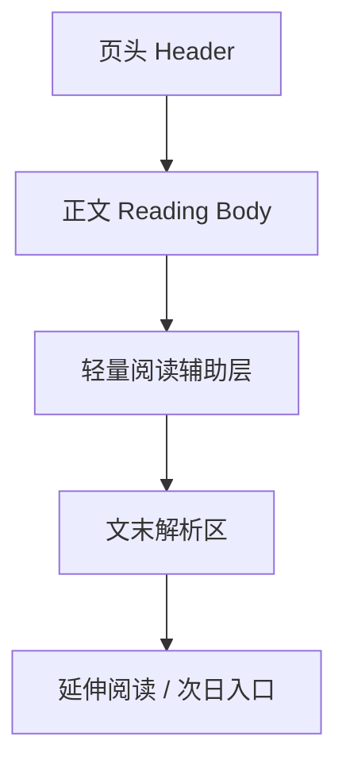
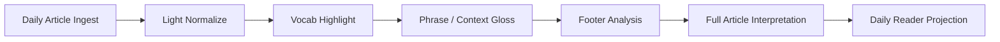

# 每日精读模块设计文档

> 文档定位：用于指导 Claread透读 的“每日精读”模块设计与开发，覆盖页面形态、内容生产链路、专用 LLM workflow、前端交互边界与数据结构。\
> 生效范围：本文档只覆盖“每日精读”这一条独立产品线，不替代主线的用户输入解析结果页设计。\
> 关联文档：
> - [小程序联调与用户体验开发设计文档](./mini-program-integration-and-ux-design.md)
> - [小程序正式上线架构与部署方案](./production-architecture-and-deployment-plan.md)
> - [TECD3 本地词典接入方案](./tecd3-local-dictionary-integration.md)

## 1. 背景与核心判断

当前项目已经明确有两类不同的阅读场景：

1. 用户输入文章，系统实时分析并返回结果
2. 平台预先筛选文章，作为“每日精读”内容供用户消费

这两类场景不能再共用同一种页面形态和同一条 workflow。

原因很明确：

- 主线解析结果页是“任务型”页面，目标是帮用户拆解任意输入文章
- 每日精读是“消费型”页面，目标是提供高质量、低打扰、可沉浸的阅读体验
- 每日精读的文本来源是平台筛选过的，噪声更低，没必要复用主线里偏防御型的 preprocess 和 repair 心智
- 每日精读适合尝试“全篇解析”这类更偏讲解型的能力，而不是把大量解析内容塞回正文

因此本模块的最终结论是：

- 每日精读页面不复用主线解析结果页布局
- 每日精读使用单独的内容数据结构和单独的 LLM workflow
- 正文区域优先保证“像在读杂志”，重解析信息收口到文末

## 2. 产品目标

每日精读模块当前阶段的目标如下：

1. 提供一页精美、可沉浸的杂志式阅读页面
2. 支持点词查词与 LLM 高亮词汇
3. 支持少量语境解释，但不把正文做成分析工作台
4. 将更重的解析内容集中放到文末
5. 为“全篇解析”能力提供独立落点
6. 建立一条预生成、可审核、可回看、可稳定发布的内容生产链路

## 3. 非目标

本阶段明确不做：

- 不复用主线结果页的 loading / degraded / retry 心智
- 不把正文做成逐句展开、逐句翻译、逐句点评的分析报告
- 不在正文内大量插入句尾 chip 或结构解释块
- 不在每日精读页面里触发实时 `/analyze` 主流程
- 不把每日精读变成新闻流或推荐流平台

## 4. 页面形态与信息架构

每日精读页面采用“正文是杂志，文末是讲义”的信息架构。



### 4.1 页头 Header

建议包含：

- 标题
- 副标题或导语
- 来源
- 日期
- 难度标签
- 阅读时长
- 主题标签
- 可选封面图或氛围图

页头职责：

- 建立内容质感
- 帮用户迅速判断“值不值得读”
- 在视觉上区分它和主线结果页

### 4.2 正文 Reading Body

正文是每日精读的核心。

正文区应优先保证：

- 像在读文章
- 版式舒服
- 信息密度适中
- 高亮是辅助，不是主角

正文区支持：

- 点词查词
- LLM 高亮词汇
- 少量短语或上下文高亮

正文区不建议：

- 大面积语法覆盖
- 句尾挂满解释入口
- 每段都附完整解析

### 4.3 轻量阅读辅助层

轻量阅读辅助层是正文的配套，不是正文本身。

建议保留：

- 单词 mini 卡片
- 单词详情 bottom sheet
- 带 LLM 标注词的 glossary 展示
- 少量语境解释

建议弱化：

- 大量结构解释
- 逐句翻译强制铺开
- 工程态 warning / degraded banner

### 4.4 文末解析区

文末是“每日精读”的真正差异化区域。

建议包含：

- 一句话摘要
- 主旨与作者意图
- 文章结构拆解
- 关键表达
- 易误读点
- 全篇解析
- 延伸思考问题

统一原则：

- 正文负责“读”
- 文末负责“学”

## 5. 与主线结果页的差异

### 5.1 主线结果页

- 任务型
- 用户主动发起分析
- 要接住不稳定输入
- 强依赖状态机和降级心智
- 更像分析工作台

### 5.2 每日精读页

- 消费型
- 平台预先准备内容
- 输入源已筛选
- 更强调阅读感和内容质感
- 更像杂志式阅读页面

### 5.3 必须保持的边界

- 不共用页面布局
- 不共用主线 analyze payload
- 不共用主线 preprocess / repair 逻辑
- 可以共用基础词典查询能力和部分高亮组件

## 6. 专用 LLM Workflow 设计

每日精读应使用单独 workflow。

### 6.1 为什么单独做

- 文章来源已筛选，文本质量可控
- 不需要为杂讯、乱码、超长异常文本投入过多 preprocess
- 可以把 token 预算集中用在讲解、提炼和篇章理解上
- 可以专门尝试全篇解析能力

### 6.2 workflow 目标

专用 workflow 应重点产出：

- 适合正文阅读的轻量高亮
- 适合文末的深度解析
- 稳定的全篇结构理解
- 可直接发布的 Daily Reader payload

### 6.3 推荐节点



### 6.4 与主线 workflow 的区别

主线更强调：

- preprocess
- repair
- degraded fallback
- 任意输入的稳态承接

每日精读更强调：

- 阅读节奏
- 高亮质量
- 篇章理解
- 文末讲解质量

## 7. 每日精读数据结构

建议单独定义 `daily_reader` payload，不与主线 `render_scene` 混用。

### 7.1 推荐结构

```json
{
  "article": {
    "id": "daily_2026_04_07_001",
    "title": "Title",
    "subtitle": "Subtitle",
    "source": "The Economist",
    "publish_date": "2026-04-07",
    "difficulty": "B2",
    "read_time_minutes": 6,
    "tags": ["culture", "society"]
  },
  "cover": {
    "image_url": null,
    "theme": "editorial_warm"
  },
  "body": {
    "paragraphs": []
  },
  "highlights": [],
  "footer_analysis": {
    "summary": "",
    "structure": [],
    "key_expressions": [],
    "full_article_analysis": [],
    "discussion_questions": []
  }
}
```

### 7.2 字段职责

#### `article`

服务：

- 页头
- 列表页摘要
- 分享文案

#### `body.paragraphs`

服务：

- 正文阅读区
- 行内高亮

#### `highlights`

服务：

- 正文轻量阅读辅助
- 点词和标注词的联动展示

#### `footer_analysis`

服务：

- 文末解析区
- 全篇解析
- 延伸思考

## 8. 正文标注策略

正文标注必须比主线克制。

### 8.1 推荐保留

- `vocab_highlight`
- `phrase_gloss`
- `context_gloss`

### 8.2 推荐弱化

- `grammar_note`
- 大段结构覆盖
- 大量句尾解释入口

### 8.3 原则

- 正文里的高亮数量必须受控
- 高亮应帮助读下去，而不是把文章切碎
- 文末解析比正文标注更重要

## 9. 词典与点词交互

每日精读页可以继续复用本地 `/dict` 词典能力，但交互边界与正文阅读目标一致。

### 9.1 普通未标注单词

- 第一次点击：显示 mini 单词卡片
- 再次点击 mini 卡片：打开 bottom sheet

### 9.2 带 LLM 标注词

- mini 卡片仍可出现
- bottom sheet 中优先展示 glossary 或语境解释
- 词典释义作为基础层补充

### 9.3 不做的交互

- 不跳转独立词典页面
- 不从词典详情再继续跳其他词条

## 10. 内容生产链路

每日精读不建议走“打开页面实时分析”。

应采用预生成链路：

1. 文章筛选
2. 编辑确认
3. Daily workflow 生成 payload
4. 人工抽检
5. 入库发布
6. 小程序前端拉取展示

### 10.1 这样做的收益

- 页面稳定
- 内容可审核
- 分享可复现
- 不受实时模型波动影响
- 更像正式内容产品

## 11. API 与后端边界

建议后端提供单独 Daily Reader API，而不是复用 `/analyze`。

### 11.1 推荐最小 API

- `GET /daily-reader/today`
- `GET /daily-reader/{id}`
- `GET /daily-reader`

如后续需要后台运营：

- `POST /daily-reader/admin/generate`
- `POST /daily-reader/admin/publish`

### 11.2 后端职责

- 拉取预生成 payload
- 返回页面所需聚合数据
- 保持内容版本稳定

不建议：

- 在用户打开页面时实时运行全流程分析

## 12. 前端模块建议

推荐至少拆出以下前端模块：

- `DailyReaderHeader`
- `DailyReaderBody`
- `DailyReaderFooterAnalysis`
- `DailyReaderBottomSheet`
- `DailyReaderProgress`

### 12.1 组件原则

- 尽量采用内容型布局，不套主线结果页壳子
- 正文组件优先关注排版、节奏、阅读感
- 文末分析组件优先关注层级清晰和可折叠性

## 13. 推荐实施顺序

### 第一步：页面信息架构与 payload 定稿

- 明确 Daily Reader 页面层级
- 定稿 `daily_reader` payload
- 明确正文区和文末区边界

### 第二步：专用 workflow PoC

- 选 3 到 5 篇文章做小样本
- 验证高亮密度
- 验证文末解析可读性
- 验证全篇解析价值

### 第三步：前端静态页面 PoC

- 用 mock data 搭杂志式页面
- 不依赖主线结果页样式
- 优先验证正文阅读体验

### 第四步：后端内容发布链路

- Daily Reader payload 入库
- 新增读取 API
- 接通前端真实拉取

### 第五步：词典和轻量交互接入

- 接入 mini card
- 接入 bottom sheet
- 接入带标注词的 glossary 展示

## 14. 验收标准

### 产品

- 页面看起来像杂志，不像分析报告
- 正文阅读流畅，不被过多解释打断
- 文末解析有明显价值

### 技术

- Daily Reader 不依赖实时 `/analyze`
- Daily Reader 有单独 payload 和单独 workflow
- 词典层只做轻辅助，不扩散复杂交互

### 体验

- 用户能顺畅读完正文
- 用户能在需要时快速点词
- 用户在文末能获得更完整的讲解和全篇理解

## 15. 建议交给执行 agent 的任务边界

### Agent 必做

- Daily Reader payload 设计
- 杂志式页面信息架构
- 专用 workflow 方案
- 文末解析区结构设计
- 与主线页面的边界说明

### Agent 不做

- 直接复用主线解析结果页布局
- 把正文做成逐句分析工作台
- 把每日精读接到实时 `/analyze`
- 复杂推荐系统
- 大而全的运营后台

这样可以确保每日精读模块从一开始就按“内容产品”而不是“分析工具”去建设。
