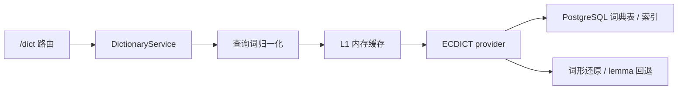

# ECDICT 词典接入方案

> 文档定位：用于指导 Claread透读 将 `/dict` 从在线第三方词典切换为 `ECDICT` 英中词典，并完成开发期验证到正式上线的数据迁移。\
> 生效范围：覆盖后端词典服务、前端词典渲染、生词本数据结构、历史回看、缓存边界与正式部署约束。\
> 关联主文档：[小程序联调与用户体验开发设计文档](./mini-program-integration-and-ux-design.md)

## 1. 背景与决策

当前项目已经完成：

- 小程序结果页全文点词查词
- 统一 `/dict` 后端入口
- `WordPopup` 真实接口接线
- 生词本本地闭环

但现有 `Free Dictionary API` 方案存在三个根本问题：

1. 释义以英文为主，不适合结果页小卡片与中文生词本
2. 第三方在线词典 API 的商用边界、配额和稳定性都不理想
3. 点词查询天然处于高频交互路径，依赖远程 API 会引入额外延迟和失败面

因此当前词典策略正式调整为：

- 前端继续只调用自有 `/dict`
- 后端 `/dict` 默认数据源切换为 `ECDICT`
- 不再把第三方在线词典 API 作为 MVP 主数据源

进一步的正式环境约束是：

- 开发期允许使用本地导入的小词库做联调验证
- 正式上线目标是将 `ECDICT` 迁入 `PostgreSQL`
- 当前磁盘 JSON 词典缓存不再继续扩展

## 2. 数据源选择

### 2.1 选型结论

MVP 默认数据源：`ECDICT`

推荐原因：

- 英中词典数据，天然适合当前中文释义需求
- 字段结构简单，足够支撑结果页卡片、详情页、生词本
- 可本地部署，无外部 API 延迟
- 开源许可清晰，适合作为 MVP 默认底座

参考来源：

- [ECDICT GitHub 仓库](https://github.com/skywind3000/ECDICT)

### 2.2 关于“短语能不能查”的研究结论

研究结论是：

- `ECDICT` 的主结构仍然是词条型数据
- 虽然增强版收录了一部分动词短语、俚语、习语和谚语
- 但从产品稳定性出发，**本项目 MVP 不再把 `phrase_gloss` 的解释责任交给词典**

原因不是 `ECDICT` 完全查不了短语，而是：

- 不能假设“所有 LLM 标注出的短语都一定命中”
- 一旦 phrase 查询失败，用户感知会直接变成“点了没解释”
- 对阅读产品来说，短语整体义本来就更接近语境解释，不适合退化成拆词查词

因此本项目对 `phrase_gloss` 的最终产品策略是：

- `phrase_gloss` 点击后不再以 `/dict` 为主解释来源
- `phrase_gloss` 必须依赖 workflow / vocabulary agent 直接给出 `glossary.zh / glossary.gloss`
- 前端将其视为“可直接渲染的短语解释卡片”，而不是“一个待查词典的 query”

参考依据：

- [ECDICT README](https://github.com/skywind3000/ECDICT)
- [ECDICT Wiki：简明英汉字典增强版](https://github.com/skywind3000/ECDICT/wiki/%E7%AE%80%E6%98%8E%E8%8B%B1%E6%B1%89%E5%AD%97%E5%85%B8%E5%A2%9E%E5%BC%BA%E7%89%88)

### 2.3 当前使用边界

本项目当前不追求：

- 权威词典级专业释义
- 完整例句库
- 高质量真人发音
- 学术级词源、搭配、辨析

本项目当前只需要：

- 单词 / 常见词形查询
- 中文短释义
- 词性
- 基础音标
- 轻量标签与词形变化

## 3. 影响范围总览

这次改造不是单点替换 provider，而是会影响以下几层。

### 3.1 后端

- `/dict` 路由协议
- 词典服务编排
- 本地词典导入与查询
- 词形还原与未命中回退
- 缓存策略

### 3.2 前端

- `WordPopup` mini 卡片显示字段
- `WordPopup` full bottom sheet 释义层级
- `dict.adapter.ts` DTO 到 VM 的映射
- 点词后的错误与空态文案
- 标注文本与单词点击优先级
- 前端轻量 lexer 对缩写、连字符、撇号和 phrase 命中的处理

### 3.3 用户资产

- 生词本字段扩展
- 历史回看中的词典展示一致性
- 未来云同步时的词典快照边界

### 3.4 文档

- 主文档中的词典路线说明
- `docs/README.md` 索引
- 后续若新增第二 provider，需要同步更新本文档

## 4. 当前代码中需要修改的地方

以下是本次接入应优先覆盖的代码位置。

### 4.1 后端核心文件

- [dict.py](C:/Users/nanpr/miniprogram/interpretation-of-english-articles/server/app/api/routes/dict.py)
- [service.py](C:/Users/nanpr/miniprogram/interpretation-of-english-articles/server/app/services/dictionary/service.py)
- [cache.py](C:/Users/nanpr/miniprogram/interpretation-of-english-articles/server/app/services/dictionary/cache.py)
- [schemas.py](C:/Users/nanpr/miniprogram/interpretation-of-english-articles/server/app/services/dictionary/schemas.py)
- [ecdict.py](C:/Users/nanpr/miniprogram/interpretation-of-english-articles/server/app/services/dictionary/providers/ecdict.py)
- [db_queries.py](C:/Users/nanpr/miniprogram/interpretation-of-english-articles/server/app/services/dictionary/db_queries.py)

### 4.2 建议新增的后端文件

- `server/app/services/dictionary/providers/base.py`
- `server/app/services/dictionary/normalizer.py`
- `server/app/services/dictionary/lemma.py`
- `server/scripts/import_ecdict.py`
- `server/app/models/ecdict.py` 或等价 ORM / SQL schema 文件
- `server/app/services/dictionary/repository.py`（如后续将查询逻辑从 provider 中进一步抽离）

### 4.3 前端受影响文件

- [client.ts](C:/Users/nanpr/miniprogram/interpretation-of-english-articles/client/src/services/api/client.ts)
- [dict-response.dto.ts](C:/Users/nanpr/miniprogram/interpretation-of-english-articles/client/src/types/api/dict-response.dto.ts)
- [dict.adapter.ts](C:/Users/nanpr/miniprogram/interpretation-of-english-articles/client/src/services/api/adapters/dict.adapter.ts)
- [render-scene.vm.ts](C:/Users/nanpr/miniprogram/interpretation-of-english-articles/client/src/types/view/render-scene.vm.ts)
- [WordPopup](C:/Users/nanpr/miniprogram/interpretation-of-english-articles/client/src/components/WordPopup/index.tsx)
- [ParagraphBlock](C:/Users/nanpr/miniprogram/interpretation-of-english-articles/client/src/components/ParagraphBlock/index.tsx)
- [ParagraphBlock/utils.ts](C:/Users/nanpr/miniprogram/interpretation-of-english-articles/client/src/components/ParagraphBlock/utils.ts)
- [InlineMark](C:/Users/nanpr/miniprogram/interpretation-of-english-articles/client/src/components/InlineMark/index.tsx)
- [vocabulary.vm.ts](C:/Users/nanpr/miniprogram/interpretation-of-english-articles/client/src/types/view/vocabulary.vm.ts)
- [storage/index.ts](C:/Users/nanpr/miniprogram/interpretation-of-english-articles/client/src/services/storage/index.ts)

## 5. 后端接入方案

### 5.1 总体结构

沿用现有词典服务骨架，但将默认 provider 切换为 `ECDICT`，并把正式环境的词典真源统一收口到 `PostgreSQL`：



### 5.2 服务职责

#### `/dict` 路由

职责：

- 参数校验
- 调用 `DictionaryService.lookup()`
- 输出统一 DTO
- 统一 404 / 502 映射

不承担：

- 直接查数据库
- 直接处理词形变化
- 直接拼装临时字段

#### `DictionaryService`

职责：

- 查询词归一化：`trim + lowercase + 去首尾标点`
- 优先查缓存
- 调用 `EcdictProvider`
- 如果 exact match 未命中，则走 lemma / exchange 回退
- 输出稳定的 `DictionaryResult`

#### `EcdictProvider`

职责：

- 读取正式词典表
- exact match 查询
- 词形回退查询
- 将原始 ECDICT 结构归一化为项目内部 DTO

### 5.3 数据落地方式

不要直接在运行时查 CSV。

推荐方式：

1. 将 `ECDICT` 数据导入正式 `PostgreSQL`
2. 运行时查询词典表
3. 对高频查询增加 L1 内存缓存

开发期说明：

- 本地联调时允许使用小词库先验证导入链路
- 但正式上线方案不再以 `SQLite` 作为词典主存储
- 如果临时保留本地 SQLite，仅作为开发便利，不再作为正式部署设计前提

推荐最小表结构：

```sql
CREATE TABLE ecdict_entries (
  word TEXT PRIMARY KEY,
  phonetic TEXT,
  definition TEXT,
  translation TEXT,
  pos TEXT,
  exchange TEXT,
  tag TEXT,
  bnc INTEGER,
  frq INTEGER
);

CREATE INDEX idx_ecdict_entries_word_nocase ON ecdict_entries (LOWER(word));
```

如需要词形还原，建议额外准备：

```sql
CREATE TABLE ecdict_lemmas (
  variant TEXT PRIMARY KEY,
  lemma TEXT
);

CREATE INDEX idx_ecdict_lemmas_variant_nocase ON ecdict_lemmas (LOWER(variant));
```

若需要处理缩写 alias，可额外增加：

```sql
CREATE TABLE ecdict_aliases (
  alias TEXT PRIMARY KEY,
  normalized TEXT NOT NULL
);

CREATE INDEX idx_ecdict_aliases_alias_nocase ON ecdict_aliases (LOWER(alias));
```

### 5.4 查询策略

推荐顺序：

1. 归一化查询词
2. 若 `type=word`，先查 exact word
3. 若 `type=word` 未命中，查 `ecdict_aliases.alias`
4. 若 alias 命中 normalized，再查 `ecdict_entries.word = normalized`
5. 若仍未命中，查 `ecdict_lemmas.variant`
6. 若命中 lemma，再查 `ecdict_entries.word = lemma`
7. 若仍未命中，返回 404

phrase 查询约束：

- MVP 阶段 `/dict` 只承担 `word` 查询主路径
- `phrase_gloss` 不再要求通过 `/dict` 命中
- phrase 的可读解释由 workflow / vocabulary agent 直接提供 glossary
- `/dict` 可以保留 `type` 参数兼容历史协议，但不再把 phrase 作为核心依赖能力

当前必须同步修正的一点：

- `/dict` 请求不能再把 `phrase_gloss` 当作必查词典对象
- `WordPopup` 需要根据标注类型区分“词典模式”和“短语解释模式”

MVP 不建议：

- 同时拼接多个在线 provider
- 在未命中时临时远程翻译补释义
- 在查询链路中调用新的 LLM

### 5.5 缓存策略

正式环境建议：

- `PostgreSQL` 词典表是 `/dict` 的真源
- 第一阶段只保留进程内 L1 内存缓存
- `Redis` 作为第二阶段增强能力预留，不作为当前上线阻塞项
- 当前 `server/.cache/dictionary/*.json` 这类磁盘缓存文件不再继续扩展

原因：

- 词典数据已经进入 `PostgreSQL` 后，不需要再维护一套 JSON 文件缓存真相
- 当前首要目标是先把登录、云端历史、收藏、生词本和词典真源统一到正式后端数据层
- Redis 更适合在多实例部署、热点词频明显上升后再引入

## 6. 推荐后端返回结构

当前前端已经有词典 DTO 和 VM，但为了更适配本地词典，建议将 `/dict` 输出扩展成下面的稳定结构：

```json
{
  "query": "discovered",
  "entry": {
    "word": "discovered",
    "lemma": "discover",
    "phonetic": "/dɪˈskʌvə/",
    "audio_url": null,
    "short_meaning": "发现；发觉",
    "meanings": [
      {
        "part_of_speech": "v.",
        "definitions": [
          {
            "meaning": "发现；发觉",
            "example": null,
            "example_translation": null
          }
        ]
      }
    ],
    "tags": ["CET4"],
    "exchange": ["discover", "discovered", "discovering"]
  },
  "provider": "ecdict",
  "cached": true
}
```

### 6.1 字段设计说明

- `query`
  - 原始查询文本
  - 方便排查点词输入和命中情况
- `entry.word`
  - 当前返回的展示词
  - 可等于查询词，也可为标准化结果
- `entry.lemma`
  - 原型词
  - 供生词本去重、回看、排序使用
- `entry.short_meaning`
  - 服务 mini 卡片和生词本列表
  - 建议取首个中文义项的精简版
- `entry.meanings`
  - 服务 full bottom sheet
  - 中文释义优先
- `entry.tags`
  - 可选
  - 如 `CET4`、`CET6`
- `entry.exchange`
  - 可选
  - 服务词形变化展示与生词本归并
- `provider`
  - 当前固定为 `ecdict`
- `cached`
  - 调试与观测字段

## 7. 前端渲染方案

### 7.1 Mini 卡片

服务组件：

- [WordPopup](C:/Users/nanpr/miniprogram/interpretation-of-english-articles/client/src/components/WordPopup/index.tsx)

建议展示：

- `word`
- `phonetic`
- `short_meaning`
- 首个 `part_of_speech`

规则：

- 没有 `phonetic` 时直接隐藏该行
- 没有 `short_meaning` 时，退回 `meanings[0].definitions[0].meaning`
- 不在 mini 卡片中展示过多条目，避免遮挡正文

### 7.2 Full 底部详情页

建议展示：

- 词头
- 音标
- 可选发音按钮
- 若当前点词来自标注词，则保留 AI glossary 区块
- 下方展示 `meanings[]`

展示约束：

- 每个词性块最多展示前 `2` 条 definition
- 总词性块建议最多展示前 `3` 组
- `exchange` 若存在，可做轻量“词形变化”折叠区

### 7.3 普通词 vs 标注词

统一规则：

- 普通词：只显示词典层
- `vocab_highlight / context_gloss`：显示词典层 + glossary / examTags 等增强信息
- `phrase_gloss`：优先显示 LLM 提供的整体短语解释，不再依赖词典命中

词典数据结构本身不需要为标注词单独分叉。

### 7.4 phrase 命中与未命中的显示策略

这是本次接入必须明确的产品边界。

#### `phrase_gloss` 的最终规则

- 点击 `phrase_gloss` 时，默认展示 LLM 提供的整体短语解释
- 不再尝试把短语作为 `/dict` 的主查询对象
- 也不在短语高亮内部继续开放“点单个词查询”

也就是说：

- 既然被标成短语，就把它视为一个稳定的语义单元
- 产品不再去赌词典是否命中该短语
- 前端不再尝试“短语查不到时拆词救场”

#### `phrase_gloss` 的数据要求

- workflow / vocabulary agent 必须提供：
  - `glossary.zh`
  - 或 `glossary.gloss`
- 若两者都缺失，则该 `phrase_gloss` 标注视为不合格输出

这条规则非常重要，因为短语解释的稳定性现在由 workflow 保证，而不是由本地词典兜底。

### 7.5 结构标注与词级点击共存

当前产品目标要求：

- 结构类标注不应阻断单词查词

推荐交互规则：

- `vocab_highlight / phrase_gloss / context_gloss`
  - 可以整体点击，打开 `WordPopup`
- `grammar_note`
  - 继续保留视觉标注
  - 句尾 chip / bottom sheet 负责结构解释
  - 其中包含的普通英文单词仍可单击查词

这意味着前端在渲染 `grammar_note` 覆盖区域时，不能简单把整段文本都吃成一个 `InlineMark` 热区。

### 7.6 缩写、特殊 token 与前端 lexer 规则

前端 [utils.ts](C:/Users/nanpr/miniprogram/interpretation-of-english-articles/client/src/components/ParagraphBlock/utils.ts) 已从简单双正则分词升级为“英文阅读 UI 的轻量 lexer”，当前已支持：

- 缩写：`U.S.`、`U.K.`、`Ph.D.`、`e.g.`
- 连字符词：`state-owned`、`well-known`
- 撇号 / 所有格：`don't`、`world's`、`students'`
- 缩写连接词：`U.S.-China`

这一层的目标不是做通用 NLP tokenization，而是稳定切出“可点英文词”。

在此基础上，MVP 还需要继续保证以下识别边界稳定：

- 缩写词：
  - `U.S.`
  - `U.K.`
  - `Ph.D.`
  - `e.g.`
- 全大写缩略词：
  - `UN`
  - `NATO`
  - `GDP`
- 特殊连接形式：
  - `U.S.-China`
  - `state-owned`
  - `world's`

推荐行为：

- 前端 lexer 先将缩写识别为单个 token
- 后端查询时增加 alias normalization：
  - `u.s.` -> `us`
  - `u.k.` -> `uk`
  - `e.g.` -> `eg`
- 若词典未命中，不要拆成单字母继续查

## 8. 当前已知问题与解决方案

### 8.1 问题一：短语高亮点击后按 `word` 查询

现象：

- 标注为短语的高亮文本被整体传入
- 前端请求却仍是 `type=word`
- 导致后端 404，看起来像词典坏掉

解决方案：

- `phrase_gloss` 点击后不再调用 `/dict`
- 直接展示 workflow 产出的 glossary
- 前端不再把短语标注当成词典查询对象
- 若 glossary 缺失，视为 workflow 输出问题，而不是词典问题

### 8.2 问题二：语法/长难句标注阻断词级点击

现象：

- 文本被 `grammar_note` 覆盖后，用户无法再单击其中的普通单词

解决方案：

- 将结构类标注从“独占点击”改成“视觉层 + 详情入口”
- 单词查词保持为基础交互，不被结构解释覆盖

### 8.3 问题三：`U.S.` 等特殊 token 的持续兼容

现象：

- 早期正则分词会把缩写和特殊 token 拆错
- 当前已升级为轻量 lexer，但仍需继续补全 alias normalization 和更多边界样例

解决方案：

- 保持前端轻量 lexer 路线，不再回退到简单双正则
- 后端增加 alias normalization
- 缩写未命中时不再分裂查询

### 8.4 还应一并考虑的其他问题

除了上面三类问题，建议同时处理以下边界：

#### 标点归一化

- `word,`
- `word.`
- `“word”`
- `word)`

这些查询词应先去掉首尾标点再查词典。

#### 大小写与专有名词

- `Israel`
- `Persian Gulf`
- `Taliban`

前端显示可以保留原样，但后端查询应大小写不敏感。

#### 撇号与所有格

- `world's`
- `students'`
- `don't`

这些不应被误切。

#### 连字符词

- `state-owned`
- `well-known`

应优先整体查，不命中时再考虑拆分展示，但不要自动拆分成两个独立请求。

#### phrase + glossary 重复问题

既然 `phrase_gloss` 不再走词典主解释路径，这类重复问题在 MVP 阶段应直接通过“只显示 glossary”来消除。

## 9. 生词本接入方案

### 9.1 目标

生词本不应只保存临时文本，而应保存可回看的词典快照。

### 9.2 推荐最小字段

当前 [vocabulary.vm.ts](C:/Users/nanpr/miniprogram/interpretation-of-english-articles/client/src/types/view/vocabulary.vm.ts) 需要扩展为至少支持：

- `id`
- `recordId`
- `word`
- `lemma`
- `phonetic`
- `partOfSpeech`
- `meaning`
- `tags`
- `exchange`
- `sourceProvider`
- `addedAt`
- `mastered`

### 9.3 去重策略

建议按以下规则去重：

- 优先用 `lemma + recordId`
- 若没有 `lemma`，退回 `word + recordId`

不要只用 `word` 去重，否则不同词形会被误认为完全不同资产。

### 9.4 回看策略

生词本回看时：

- 优先展示保存时的词典快照
- 不要重新请求 `/dict` 才能展示
- 如用户主动刷新释义，再显式调用 `/dict`

## 10. 迁移步骤建议

### 第一步：后端骨架改造

- 增加 `providers/base.py`
- 增加 `providers/ecdict.py`
- 增加 ECDICT 导入脚本
- `DictionaryService` 切换到本地 provider
- 补齐 abbreviation alias normalization
- 校验 `phrase_gloss` 输出时 glossary 字段的稳定性

### 第二步：协议扩展

- 扩展 `/dict` 返回字段：`query`、`entry.lemma`、`short_meaning`、`tags`、`exchange`、`provider`、`cached`
- 同步更新前端 DTO 与 adapter
- `fetchDict` 继续服务 `word` 查询主路径，不再把 `phrase_gloss` 作为必查对象

### 第三步：前端渲染切换

- `WordPopup` mini / full 两层适配新字段
- 清理“词典 API 暂未接入”类旧 fallback 文案
- `phrase_gloss` 点击后直接渲染 glossary 解释
- `grammar_note` 不再阻断词级点击
- 前端轻量 lexer 继续覆盖缩写与特殊 token，并与后端 alias normalization 对齐

### 第四步：生词本升级

- 扩展 `VocabEntry`
- 保存 `lemma / phonetic / tags / exchange / provider`
- 调整去重逻辑

### 第五步：回归与联调

- 常见词命中
- 词形变化命中
- `phrase_gloss` 点击直接显示 glossary
- `phrase_gloss` 不再触发 `/dict` 请求
- 缩写词命中（如 `U.S.`）
- 查空词
- 结果页普通词点击
- 标注词点击
- `grammar_note` 覆盖区内词级点击
- 生词本保存与回看

## 11. 验收标准

### 后端

- `/dict` 不再依赖在线词典 API
- `ECDICT` 查询延迟稳定在低可感知范围
- 常见词形可通过 lemma 回退命中
- `phrase_gloss` 的 glossary 输出稳定，不再依赖词典命中
- `/dict` 返回稳定中文释义结构

### 前端

- 普通词点击可稳定看到中文 mini 卡片
- 标注词点击保留增强解释
- `phrase_gloss` 点击不再表现为词典查询失败
- `phrase_gloss` 内部不再支持单词级拆分查询
- `grammar_note` 不阻断单词查询
- `U.S.` 一类缩写不会被拆成单字母查询
- full 弹层层级清晰，不出现英文释义主导的体验

### 生词本

- 加入生词本后可稳定回看
- 同词不同词形不会产生明显重复污染
- 生词本列表可直接显示中文短释义

## 12. 文档维护要求

- 主线词典决策以 [mini-program-integration-and-ux-design.md](./mini-program-integration-and-ux-design.md) 为准
- 本文档负责详细执行方案和影响范围
- 若后续新增第二 provider，必须同步更新：
  - 本文档
  - 主文档 Phase B.1
  - `docs/README.md`

## 13. 建议交给执行 agent 的任务边界

如果将本方案交给其他 agent 执行，建议明确边界如下：

### Agent 必做

- `ECDICT` provider
- PostgreSQL 导入脚本 / 导入流程
- `/dict` DTO 扩展
- `WordPopup` 区分词典模式与短语解释模式
- 前端轻量 lexer 与 alias normalization 对齐
- `grammar_note` 与词级点击共存
- 生词本模型扩展
- 校验 `phrase_gloss` 的 glossary 兜底是否稳定

### Agent 不做

- 登录与云同步
- OCR
- 新增第二在线词典 provider
- 用 LLM 临时补全普通词词典释义
- 大范围结果页 UI 重构

这样可以避免任务跑偏成“顺手重构整个结果页”或“顺手加多词典切换”。
