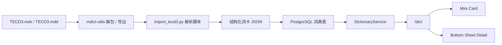

# TECD3 本地词典接入方案

> 文档定位：用于指导 Claread透读 将 `/dict` 的本地词典真源从 `ECDICT` 调整为 `TECD3`（英汉大词典第三版 MDX 资源），并完成离线解析、PostgreSQL 导入、单词卡片建模与查询接线。\
> 生效范围：覆盖 TECD3 解析、数据库 schema、`/dict` 查询结构、前端单词卡片与底部详情弹层的字段边界。\
> 关联主文档：[小程序联调与用户体验开发设计文档](./mini-program-integration-and-ux-design.md)

## 1. 背景与决策

当前项目已经完成：

- 统一 `/dict` 后端入口
- 结果页全文点词查词
- `WordPopup` 真实接口接线
- 生词本本地闭环

但 `ECDICT` 方案存在一个已经确认的产品问题：

1. `translation` 主字段过于扁平，不适合稳定生成单词卡片
2. 运行时临时切分释义，容易导致短释义、词性块和详情层级不稳定
3. 查词在本项目中不是核心功能，不值得为了词典层做复杂的运行时解析和跳转式体验

因此当前词典策略调整为：

- `/dict` 继续只查本地数据库，不接第三方在线词典 API
- 本地词典真源从 `ECDICT` 调整为 `TECD3`
- `TECD3` 只作为离线导入源，不在运行时直接读取 `.mdx/.mdd`
- 词典功能优先服务“单词小卡片 + 底部详情弹层”，不扩展成完整词典浏览器

## 2. 产品目标与边界

### 2.1 产品目标

本次接入只服务两个交互层：

1. 第一次点击普通单词时显示 mini 卡片，避免打断阅读
2. 再次点击 mini 卡片时，打开底部详情弹层，展示稍多一点的基础释义信息

### 2.2 明确不做

本次方案不追求：

- 独立词典详情页
- 词条内继续跳转到其他词条
- 同义词、反义词、词源学级别完整浏览
- 复杂的词典导航、目录和歧义页交互
- 为普通未标注单词接入 LLM 临时补释义

### 2.3 与 LLM 标注层的分工

词典层职责：

- 提供一般性释义
- 提供稳定词头、音标、词性、短释义、少量义项和例句
- 服务 mini 卡片和 bottom sheet

LLM 层职责：

- `phrase_gloss`、`context_gloss`、`vocab_highlight` 的语境释义
- 真正有价值的阅读解释
- 高价值、上下文相关的补充信息

统一原则：

- 普通未标注单词：词典层优先
- 带 LLM 标注的单词：词典层做基础层，LLM 做增强层
- `phrase_gloss` 不依赖词典命中作为稳定性前提

## 3. 为什么选择 TECD3

### 3.1 当前已知资源

当前本地资源目录：

- [英汉大词典（第三版）.mdx](C:/Users/nanpr/miniprogram/interpretation-of-english-articles/.ecdict/Mdict/TECD3/英汉大词典（第三版）.mdx)
- [英汉大词典（第三版）.mdd](C:/Users/nanpr/miniprogram/interpretation-of-english-articles/.ecdict/Mdict/TECD3/英汉大词典（第三版）.mdd)
- [tecd3.css](C:/Users/nanpr/miniprogram/interpretation-of-english-articles/.ecdict/Mdict/TECD3/tecd3.css)

### 3.2 结构优势

从 `tecd3.css` 可反推出该词典成品中存在较清晰的结构块：

- 词头容器：`.hg`
- 词头：`.hwSpan`
- 音标：`.pr`
- 词性：`.pos`
- 义项列表：`.se2g`
- 释义正文：`.df`
- 例句块：`.egBlock`
- 英文例句：`.ex`
- 例句译文：`.tr`
- 短语区：`.phrase`
- 派生词区：`.derivative`
- 说明区：`.noteDiv`
- 词源区：`.etym`

这意味着：

- `TECD3` 更适合作为“离线结构化词卡源”
- 解析策略可以围绕 HTML 语义块提取
- 不需要像 `ECDICT` 一样依赖扁平文本临时拼卡片

## 4. 总体接入方案



关键原则：

- 运行时只查 PostgreSQL
- `mdx/mdd` 只参与离线导入
- `mdict-utils` 作为默认的 MDX/MDD 解包与导出工具
- 前端消费的不是原始词条 HTML，而是已经为词卡整理好的结构

## 5. 数据落地方式

### 5.1 设计原则

这次不是做“完整词典数据库”，而是做“词卡数据库”。

因此 schema 优先满足：

- 单词小卡片
- 底部详情弹层
- 生词本快照复用
- 后续解析规则可迭代

### 5.2 推荐表结构

#### `dict_entries`

```sql
CREATE TABLE dict_entries (
  id BIGSERIAL PRIMARY KEY,
  source TEXT NOT NULL,
  headword TEXT NOT NULL,
  normalized_headword TEXT NOT NULL,
  phonetic TEXT,
  primary_pos TEXT,
  short_meaning TEXT,
  meanings_json JSONB NOT NULL DEFAULT '[]'::jsonb,
  examples_json JSONB NOT NULL DEFAULT '[]'::jsonb,
  phrases_json JSONB NOT NULL DEFAULT '[]'::jsonb,
  raw_html TEXT,
  parse_version TEXT NOT NULL,
  display_quality TEXT NOT NULL DEFAULT 'rich',
  created_at TIMESTAMPTZ NOT NULL DEFAULT NOW(),
  updated_at TIMESTAMPTZ NOT NULL DEFAULT NOW()
);

CREATE UNIQUE INDEX idx_dict_entries_lookup
  ON dict_entries (source, normalized_headword);
```

字段说明：

- `source`：固定为 `tecd3`
- `headword`：原始词头
- `normalized_headword`：用于查询的归一化词头
- `phonetic`：音标
- `primary_pos`：主词性
- `short_meaning`：mini 卡片短释义
- `meanings_json`：详情页义项
- `examples_json`：详情页例句
- `phrases_json`：详情页常见短语
- `raw_html`：原始词条 HTML，便于重新解析
- `parse_version`：解析器版本
- `display_quality`：`rich / mini_only / raw_fallback`

#### `dict_aliases`

```sql
CREATE TABLE dict_aliases (
  alias TEXT PRIMARY KEY,
  normalized_headword TEXT NOT NULL,
  source TEXT NOT NULL
);

CREATE INDEX idx_dict_aliases_lookup
  ON dict_aliases (source, alias);
```

作用：

- 缩写映射
- 连字符/空格变体
- 大小写和标点归一化后的别名命中

### 5.3 先不做的表

本阶段先不单独建：

- 词源表
- 派生词表
- 资源文件表
- 复杂导航和歧义页索引表

原因：

- 不是核心功能
- 当前交互只需要 mini card 和 bottom sheet
- 过早拆分会增加解析和维护成本

## 6. 词卡结构设计

### 6.1 mini 卡片需要的字段

- `word`
- `phonetic`
- `primary_pos`
- `short_meaning`

### 6.2 bottom sheet 需要的字段

- `word`
- `phonetic`
- `primary_pos`
- `short_meaning`
- `meanings`
- `examples`
- `phrases`

### 6.3 推荐 JSON 结构

#### `meanings_json`

```json
[
  {
    "part_of_speech": "n.",
    "definitions": [
      {
        "meaning": "范式；典范"
      },
      {
        "meaning": "样板；模式"
      }
    ]
  }
]
```

#### `examples_json`

```json
[
  {
    "example": "a new paradigm for research",
    "example_translation": "一种新的研究范式"
  }
]
```

#### `phrases_json`

```json
[
  {
    "phrase": "paradigm shift",
    "meaning": "范式转变"
  }
]
```

### 6.4 展示裁剪规则

为了避免词典层过重，统一限制如下：

- `short_meaning` 最长建议 24 到 32 个字
- `meanings` 最多展示 3 个词性块
- 每个词性块最多展示 3 条 definition
- `examples` 最多展示 2 条
- `phrases` 最多展示 3 条

## 7. 离线解析方案

### 7.1 解析目标

优先提取：

- 词头
- 音标
- 主词性
- 短释义
- 基础义项
- 少量例句
- 少量短语

延后提取：

- 派生词
- note
- etymology
- 复杂导航
- 歧义页特殊展示逻辑

### 7.1.1 默认工具链

本方案默认使用以下工具链：

1. `mdict-utils`
   - 负责读取 `.mdx/.mdd`
   - 负责导出词条原始内容
   - 只用于离线导入阶段，不进入运行时链路
2. `import_tecd3.py`
   - 负责解析 `mdict-utils` 导出的词条内容
   - 负责生成结构化词卡
   - 负责写入 PostgreSQL

统一约束：

- 不在 `/dict` 运行时直接调用 `mdict-utils`
- 不在运行时直接读取 `.mdx/.mdd`
- 不在运行时即时解析 HTML 生成单词卡片

### 7.2 解析来源

解析规则优先依据 `mdict-utils` 导出的词条 HTML：

- `.hwSpan`
- `.pr`
- `.pos`
- `.se2g`
- `.df`
- `.egBlock .ex`
- `.egBlock .tr`
- `.phrase`

### 7.3 `short_meaning` 生成规则

推荐顺序：

1. 取第一词性块的前 1 到 2 条释义
2. 去掉编号、噪声标签、括号性补充
3. 组合为中文短释义
4. 超长则截断
5. 如果提取失败，则回退到第一条释义纯文本

### 7.4 `primary_pos` 生成规则

推荐顺序：

1. 取首个稳定 `.pos`
2. 若未提取到，则从第一义项块推断
3. 再不行则置空，不做错误猜测

### 7.5 `display_quality` 规则

- `rich`：已成功提取稳定词头、短释义和义项
- `mini_only`：只有词头、音标、短释义，详情结构不稳定
- `raw_fallback`：仅保留原始 HTML 和最基础文本，不建议展示完整详情

## 8. `/dict` 查询方案

### 8.1 查询流程

推荐顺序：

1. 归一化查询词
2. 查 `dict_aliases.alias`
3. 查 `dict_entries.normalized_headword`
4. 若未命中，返回 404

### 8.2 归一化规则

- `trim`
- `lowercase`
- 去首尾标点
- 处理弯引号
- 处理撇号和缩写

### 8.3 返回结构

```json
{
  "query": "paradigm",
  "provider": "tecd3",
  "cached": true,
  "entry": {
    "word": "paradigm",
    "phonetic": "/ˈpærədaɪm/",
    "primary_pos": "n.",
    "short_meaning": "范式；典范；样板",
    "meanings": [
      {
        "part_of_speech": "n.",
        "definitions": [
          {
            "meaning": "范式；典范"
          }
        ]
      }
    ],
    "examples": [
      {
        "example": "a new paradigm for research",
        "example_translation": "一种新的研究范式"
      }
    ],
    "phrases": [
      {
        "phrase": "paradigm shift",
        "meaning": "范式转变"
      }
    ],
    "display_quality": "rich"
  }
}
```

### 8.4 统一原则

- mini 卡片永远优先可渲染
- 详情弹层只展示“比 mini 多一点”的内容
- `/dict` 不提供跳词、导航、更多页能力

## 9. 前端渲染方案

### 9.1 第一次点击

普通未标注单词：

- 弹出 mini 卡片
- 展示 `word / phonetic / primary_pos / short_meaning`
- 卡片底部提示“再次点击查看详情”

### 9.2 再次点击

打开 bottom sheet：

- 展示词头、音标、短释义
- 展示少量义项
- 展示少量例句
- 可选展示常见短语

### 9.3 不再做的交互

- 不跳转独立词典页
- 不从详情里继续查别的词
- 不引入复杂 tab 或层层 drill-down

### 9.4 带 LLM 标注时的规则

- 若当前词有 glossary 或其他 LLM 增强信息，则在详情层优先显示 LLM 区块
- 词典释义作为基础层补充
- `phrase_gloss` 继续优先使用 LLM 整体解释

## 10. 对现有代码的影响范围

### 10.1 后端

- [dict.py](C:/Users/nanpr/miniprogram/interpretation-of-english-articles/server/app/api/routes/dict.py)
- [service.py](C:/Users/nanpr/miniprogram/interpretation-of-english-articles/server/app/services/dictionary/service.py)
- [cache.py](C:/Users/nanpr/miniprogram/interpretation-of-english-articles/server/app/services/dictionary/cache.py)
- `server/app/services/dictionary/providers/tecd3.py`
- `server/app/services/dictionary/repository.py`
- `server/scripts/import_tecd3.py`

### 10.2 前端

- [client.ts](C:/Users/nanpr/miniprogram/interpretation-of-english-articles/client/src/services/api/client.ts)
- [dict.adapter.ts](C:/Users/nanpr/miniprogram/interpretation-of-english-articles/client/src/services/api/adapters/dict.adapter.ts)
- [WordPopup](C:/Users/nanpr/miniprogram/interpretation-of-english-articles/client/src/components/WordPopup/index.tsx)
- [render-scene.vm.ts](C:/Users/nanpr/miniprogram/interpretation-of-english-articles/client/src/types/view/render-scene.vm.ts)
- [storage/index.ts](C:/Users/nanpr/miniprogram/interpretation-of-english-articles/client/src/services/storage/index.ts)

## 11. 迁移步骤建议

### 第一步：PoC 解析

- 使用 `mdict-utils` 导出 TECD3 词条
- 抽样验证 30 到 50 个常见词
- 确认 `headword / phonetic / pos / meanings / examples` 是否可稳定提取

### 第二步：schema 落地

- 创建 `dict_entries`
- 创建 `dict_aliases`
- 编写 PostgreSQL migration

### 第三步：导入脚本

- 编写 `import_tecd3.py`
- 读取 `mdict-utils` 导出的词条内容
- 将词条 HTML 解析为结构化词卡
- 写入 `dict_entries`
- 生成必要 alias

### 第四步：provider 切换

- 新增 `Tecd3Provider`
- `DictionaryService` 默认改查 `TECD3`
- 保留缓存层

### 第五步：前端适配

- mini 卡片只读基础字段
- bottom sheet 读取 `meanings/examples/phrases`
- 去掉复杂跳转和不必要交互

## 12. 验收标准

### 后端

- `/dict` 默认数据源已切换为 `TECD3`
- 查询继续只查 PostgreSQL
- 常见单词可稳定返回 `word / phonetic / primary_pos / short_meaning`
- 大部分高频词条可返回基础义项和少量例句

### 前端

- 普通单词第一次点击显示 mini 卡片
- 再次点击 mini 卡片打开 bottom sheet
- 详情层信息比 mini 多，但不过度复杂
- 不出现词典内跳转页
- 带 LLM 标注时，详情页可共存展示词典基础层和 LLM 增强层

### 产品体验

- 查词不再明显打断阅读
- mini 卡片信息足够帮助快速理解
- 详情弹层足够支撑“想再看一点”的需求
- 词典层不与 LLM 语境释义抢主角色

## 13. 建议交给执行 agent 的任务边界

### Agent 必做

- TECD3 抽样解析验证
- `dict_entries / dict_aliases` schema
- `import_tecd3.py`
- `Tecd3Provider`
- `/dict` DTO 调整
- mini 卡片和 bottom sheet 字段适配

### Agent 不做

- 独立词典页面
- 词条内继续跳转
- 复杂词源/辨析系统
- 三方在线词典 API 集成
- 大规模结果页 UI 重构

这样可以保证词典层始终是阅读辅助能力，而不是跑偏成第二产品。
