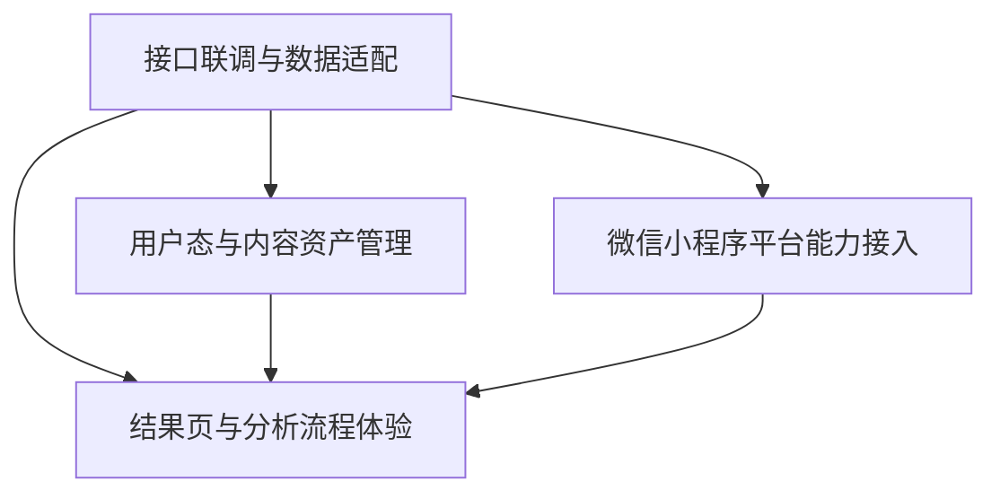

# 小程序联调与用户体验开发设计文档

> 文档定位：用于指导 Claread透读 微信小程序侧的真实联调、用户主链路建设与平台能力接入。  
> 生效范围：本稿用于和 workflow 输出优化并行推进的小程序产品开发，不替代后端 workflow 设计文档。  
> 核心目标：在 `/analyze` 仍持续优化的情况下，先建立一个真实可跑、可回看、可恢复、可交互的小程序产品闭环。

## 1. 背景

当前项目已经进入两条主线并行推进阶段：

- 后端主线：继续优化 workflow 输出质量与稳定性
- 小程序主线：完成真实接口联调与用户完整体验开发

这两条主线不能再互相阻塞。

原因很明确：

- workflow 质量还需要持续迭代，但小程序产品开发量本身已经足够大
- 真实用户体验问题不会只出现在 `/analyze` 输出质量上，还会出现在 loading、错误恢复、回看、分享、登录态、页面跳转与微信平台能力接入上
- 如果继续等待 workflow “完全满意”再做联调，小程序整体进度会被单点问题长期卡住

因此本阶段的产品策略是：

- 不等待 `/analyze` 达到最终理想质量
- 先把“从输入到得到可交互结果页”的完整链路跑通
- 用前端容错、状态设计和平台接入，把产品主路径真正搭起来

## 2. 设计目标

本阶段目标按优先级排序如下：

1. 小程序前端从 mock 切换到真实后端接口
2. 用户从输入文本到查看结果的主链路完整可跑
3. 对空结果、warning、降级结果、失败重试都有明确体验设计
4. 形成最小可用的用户资产闭环，包括历史记录与回看
5. 把微信小程序平台能力接入成工程任务，而不是后期补丁

## 3. 非目标

本阶段明确不追求以下内容：

- 不等待 `/analyze` 输出质量达到“上线级”再开始联调
- 不一次性做完全部运营、学习、推荐能力
- 不在这一阶段把所有用户配置都开放给前端
- 不把复杂平台能力如 OCR、订阅消息作为当前 MVP 阻塞项

## 4. 总体拆分

小程序联调与用户体验开发拆成四条主线：

1. 接口联调与数据适配
2. 结果页与分析流程体验
3. 用户态与内容资产管理
4. 微信小程序平台能力接入

这四条主线的关系如下：

解释：

- `接口联调与数据适配` 是前置基础
- `结果页与分析流程体验` 是用户直接感知的主链路
- `用户态与内容资产管理` 决定产品是否只是一次性工具
- `微信小程序平台能力接入` 决定产品是否真正适配小程序环境

## 5. 主线一：接口联调与数据适配

### 5.1 目标

让前端结果页不再依赖 mock，而是消费真实 `/analyze` 响应，并具备稳定的协议适配能力。

### 5.2 核心任务

- 建立小程序前端统一 API 层
- 接入真实 `/analyze` 请求
- 建立后端响应到前端视图模型的 adapter
- 统一 snake_case 到前端消费结构的转换规则
- 明确请求的超时、重试、取消和去重策略
- 准备固定联调样本集

### 5.3 必须处理的结果类型

前端不能只适配“理想结果”，必须明确接住以下场景：

- 正常结果
- 有 warning 的结果
- 无标注但有翻译的结果
- 局部降级结果
- 后端错误
- 超时与重试

### 5.4 交付物

- 统一 API client
- `render_scene` adapter
- 联调样本清单
- 联调说明文档

### 5.5 验收标准

- 结果页已可切换为真实接口数据源
- mock 与真实接口的切换集中在单一入口
- 页面与组件不再各自散落字段转换逻辑
- warning / 空态 / 降级结果可稳定渲染

## 6. 主线二：结果页与分析流程体验

### 6.1 目标

把“输入文本 -> 等待分析 -> 查看结果 -> 用户继续操作”的体验做成完整产品链路。

### 6.2 核心任务

- 输入页到结果页的真实跳转打通
- 设计分析中的 loading 态
- 明确超时与失败提示
- 为空结果、warning、部分成功结果提供独立状态页或组件
- 补齐重试机制
- 补齐结果页核心交互
- 增加用户反馈入口

### 6.3 分析中状态要求

分析中页面至少要覆盖：

- 初始发起中
- 正在分析中
- 超时等待中
- 分析失败可重试

不能只有一个统一 spinner。

### 6.4 结果页状态要求

结果页至少要支持：

- 正常结果页
- 仅翻译结果页
- 带 warning 的结果页
- 空结果说明页
- 网络或服务异常页

### 6.5 结果页交互范围

第一阶段建议纳入：

- inline mark 点击
- 底部详情弹层
- 句子翻译查看
- warning 展开与收起
- 一键重新分析
- 返回修改文本
- 用户反馈入口

### 6.6 交付物

- 输入页到结果页完整主链路
- loading / error / empty / degraded 组件
- 结果页真实联调版本
- 统一错误文案与状态文案

### 6.7 验收标准

- 从输入文本到查看结果完整可跑
- 所有主要状态都有对应 UI
- 结果页不再假设“每次一定有丰富标注”
- warning 和失败信息对用户可见、可理解

## 7. 主线三：用户态与内容资产管理

### 7.1 目标

让 Claread透读 不只是一次性分析工具，而是具有回看、保存与持续使用价值的产品。

### 7.2 核心任务

- 设计最小登录策略
- 建立分析记录保存能力
- 提供最近记录列表
- 支持收藏 / 删除 / 再次查看
- 支持重新分析历史文本
- 预留用户配置入口，但 baseline 默认固定

### 7.3 登录策略原则

当前阶段建议：

- 允许用户先体验主流程
- 登录态不要成为第一次使用的阻塞项
- 需要保存、同步、收藏等动作时，再逐步引导进入登录态

### 7.4 内容资产范围

建议最小保存内容包括：

- 原始文本
- 分析请求参数
- 返回的 `render_scene`
- 生成时间
- 当前状态
- 基础反馈信息

### 7.5 第一阶段不强制开放的内容

- 全部阅读配置切换
- 学习统计
- 复杂标签分类
- 高级搜索与筛选

### 7.6 交付物

- 用户记录数据模型草案
- 历史记录页
- 收藏与删除能力
- 回看与重新分析能力
- 登录态与匿名态策略说明

### 7.7 验收标准

- 用户离开结果页后仍可回看历史内容
- 切后台或重新进入小程序后，主路径上下文不会完全丢失
- 保存与回看能力和真实接口结构兼容

## 8. 主线四：微信小程序平台能力接入

### 8.1 目标

把产品真正放进微信小程序环境，而不是只做一套页面壳。

### 8.2 核心任务

- 登录与身份态接入
- 本地缓存策略
- 分享能力接入
- 剪贴板与粘贴体验优化
- 路由与页面栈恢复
- 前后台切换状态恢复
- 埋点与异常上报
- 真机性能与包体检查
- 平台合规项检查

### 8.3 必须关注的微信平台问题

以下内容不能后期随意补：

- 小程序登录链路
- 页面切后台后的分析状态恢复
- 分享结果页的入口设计
- 本地缓存与请求重放
- 真机性能问题
- 审核与合规敏感点

### 8.4 平台能力建议分层

#### 小程序前端层

负责：

- 页面
- 交互
- 本地缓存
- 页面路由
- 分享入口

#### 轻服务或云函数层

可负责：

- 简单 CRUD
- 登录态辅助
- 内容安全审核调用

#### 核心后端层

负责：

- `/analyze`
- workflow
- 业务规则
- 结构化输出
- 模型调用

### 8.5 交付物

- 平台接入清单
- 生命周期处理方案
- 埋点与异常上报方案
- 发布前检查清单

### 8.6 验收标准

- 关键主路径可在真机稳定运行
- 切后台、弱网、重进小程序不导致主流程直接报废
- 分享、缓存、路由返回符合产品预期

## 9. 依赖关系与并行建议

### 9.1 强依赖

- `接口联调与数据适配` 是其他三条主线的共同底座

### 9.2 可并行推进

- `结果页与分析流程体验`
- `用户态与内容资产管理`
- `微信小程序平台能力接入`

### 9.3 建议的并行分工

如果按 2 个 agent 分工：

- Agent 1：接口联调与结果页体验
- Agent 2：用户态与微信平台能力

如果按 3 个 agent 分工：

- Agent 1：`/analyze` 联调与 adapter
- Agent 2：结果页状态与交互体验
- Agent 3：登录、历史记录与微信平台能力

## 10. MVP 与非 MVP 边界

### 10.1 当前阶段建议纳入 MVP

- 真实 `/analyze` 联调
- API adapter
- loading / error / empty / degraded 状态
- 结果页核心交互
- 历史记录最小闭环
- 登录策略说明与基础落地
- 小程序基础平台能力接入

### 10.2 当前阶段可延后

- OCR
- 订阅消息
- 学习统计
- 高级配置中心
- 复杂推荐与运营能力
- 复杂多端统一体验

## 11. 评审关注点

评审这份文档时，建议重点看以下问题：

1. 是否已经覆盖真实用户主路径，而不是只覆盖“分析成功”理想态
2. 是否把 mock 思维切换成了真实接口思维
3. 是否把 warning / 空结果 / 降级结果纳入产品设计
4. 是否把历史记录和回看纳入最小产品闭环
5. 是否把微信平台能力作为独立工程任务对待
6. 是否仍存在会被 `/analyze` 质量持续阻塞的开发依赖

## 12. 最终结论

小程序联调与用户体验开发，不应继续等待 workflow 输出达到最终理想状态再开始。

当前更合理的策略是：

- workflow 继续独立优化
- 小程序侧同步建立真实接口、真实状态、真实用户路径和真实平台能力

这样做的价值是：

- 不让模型质量问题长期阻塞产品开发
- 尽早暴露真实链路里的体验问题
- 把 Claread透读 从“后端可跑”推进到“产品可用”
