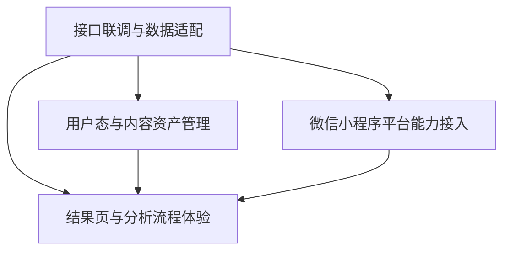

# 小程序联调与用户体验设计文档

> 文档定位：Claread透读 微信小程序侧的用户主链路设计、状态映射、前后端边界与平台能力接入的长期设计文档。  
> 生效范围：本稿覆盖用户输入解析结果页相关链路的设计决策，不替代后端 workflow 设计文档。  
> 关联文档：
> - [ARCHITECTURE.md](./ARCHITECTURE.md) — 架构决策记录（ID 契约、同步策略等）
> - [dictionary-service-architecture.md](./dictionary-service-architecture.md) — 词典服务架构
> - [daily-reader-module-design.md](./daily-reader-module-design.md) — 每日精读独立设计

补充范围说明：

- 本文档当前只覆盖“用户输入解析结果页”相关链路
- “每日精读结果页”暂不纳入本稿范围，后续单独设计与开发
- 每日精读不按“用户点击后实时调用 `/analyze` 再渲染”的模式处理，而更适合走独立内容生产、拉取与展示链路
- 因此，本文档讨论的 `/analyze` 联调默认面向 `user_input` 场景，不把 `daily_article` 作为当前联调对象

## 1. 背景

当前项目已经进入两条主线并行推进阶段：

- 后端主线：继续优化 workflow 输出质量与稳定性
- 小程序主线：完成真实接口联调与用户完整体验开发

这两条主线不能再互相阻塞。

原因很明确：

- workflow 质量还需要持续迭代，但小程序产品开发量本身已经足够大
- 真实用户体验问题不会只出现在 `/analyze` 输出质量上，还会出现在 loading、错误恢复、回看、分享、登录态、页面跳转与微信平台能力接入上
- 如果继续等待 workflow “完全满意”再做联调，小程序整体进度会被单点问题长期卡住

因此本阶段的产品策略是：

- 不等待 `/analyze` 达到最终理想质量
- 先把“从输入到得到可交互结果页”的完整链路跑通
- 用前端容错、状态设计和平台接入，把产品主路径真正搭起来
- 当前主路径特指“用户输入文本 -> 提交 `/analyze` -> 查看解析结果”

## 2. 设计目标

本阶段目标按优先级排序如下：

1. 小程序前端从 mock 切换到真实后端接口
2. 用户从输入文本到查看结果的主链路完整可跑
3. 对空结果、warning、降级结果、失败重试都有明确体验设计
4. 形成最小可用的用户资产闭环，包括历史记录与回看
5. 把微信小程序平台能力接入成工程任务，而不是后期补丁

## 3. 非目标

本阶段明确不追求以下内容：

- 不等待 `/analyze` 输出质量达到“上线级”再开始联调
- 不一次性做完全部运营、学习、推荐能力
- 不在这一阶段把所有用户配置都开放给前端
- 不把复杂平台能力如 OCR、订阅消息作为当前 MVP 阻塞项
- 不在这一阶段处理“每日精读结果页”的产品设计与联调
- 不把每日文章点击后的阅读体验强行并入 `/analyze` 实时解析链路

## 4. 总体拆分

小程序联调与用户体验开发拆成四条主线：

1. 接口联调与数据适配
2. 结果页与分析流程体验
3. 用户态与内容资产管理
4. 微信小程序平台能力接入

这四条主线的关系如下：

```mermaid
flowchart TD
  A["接口联调与数据适配"] --> B["结果页与分析流程体验"]
  A --> C["用户态与内容资产管理"]
  A --> D["微信小程序平台能力接入"]
  C --> B
  D --> B
```

解释：

- `接口联调与数据适配` 是前置基础
- `结果页与分析流程体验` 是用户直接感知的主链路
- `用户态与内容资产管理` 决定产品是否只是一次性工具
- `微信小程序平台能力接入` 决定产品是否真正适配小程序环境

## 5. 主线一：接口联调与数据适配

### 5.1 目标

让“用户输入解析结果页”不再依赖 mock，而是消费真实 `/analyze` 响应，并具备稳定的协议适配能力。

### 5.2 核心任务

- 建立小程序前端统一 API 层
- 接入真实 `/analyze` 请求
- 建立后端响应到前端视图模型的 adapter
- 统一 snake_case 到前端消费结构的转换规则
- 明确请求的超时、重试、取消和去重策略
- 准备固定联调样本集

补充说明：

- 此处 `/analyze` 只用于用户主动提交文本后的解析链路
- 每日精读若后续上线，建议走“预生成内容 + 页面拉取渲染”链路，而不是复用这里的实时解析流程

### 5.3 必须处理的结果类型

前端不能只适配“理想结果”，必须明确接住以下场景：

- 正常结果
- 有 warning 的结果
- 无标注但有翻译的结果
- 局部降级结果
- 后端错误
- 超时与重试

补充约定：

- 后端内部 `warnings`、异常码和局部失败信号不应直接原样暴露给用户
- 前端结果页只展示产品级状态，不展示工程级错误细节
- 当前结果页以 `loading / normal / degraded_light / degraded_heavy / empty / failed / timeout / network_fail` 作为唯一页面状态入口
- 当前成功态已经开始消费后端 `user_facing_state`，但 `empty / failed / timeout / network_fail` 仍由前端页面状态机负责聚合

### 5.4 前后端状态边界

当前建议的边界如下：

- 后端负责产出稳定的正文结构、翻译、行内标注、句尾入口、warnings、错误码，以及成功态下的 `user_facing_state`
- 前端负责把这些技术信号聚合为用户可理解的状态、提示文案和交互入口，并继续兜底 `empty` 与错误态
- 后续需要继续收敛 `user_facing_state` 的判定规则，避免仅因非关键 warning 就触发降级 banner

当前页面状态映射原则：

| 输入信号 | 页面状态 | 用户表现 |
|------|------|----------|
| 有可渲染结果且无明显异常 | `normal` | 正常渲染结果页 |
| 有结果但部分深度讲解缺失 | `degraded_light` | 顶部轻提示 banner |
| 有结果但内容完整度明显不足 | `degraded_heavy` | 明显降级提示 + 重新分析入口 |
| 请求成功但无有效内容 | `empty` | 空状态页 + 修改重试 |
| 非网络型服务失败 | `failed` | 错误状态页 + 重试 |
| 请求超时 | `timeout` | 超时状态页 + 重试 |
| 网络异常 | `network_fail` | 网络错误页 + 重试 |

### 5.5 交付物

- 统一 API client
- `render_scene` adapter
- 联调样本清单
- 联调说明文档

### 5.6 验收标准

- 结果页已可切换为真实接口数据源
- mock 与真实接口的切换集中在单一入口
- 页面与组件不再各自散落字段转换逻辑
- warning / 空态 / 降级结果可稳定渲染

## 6. 主线二：结果页与分析流程体验

### 6.1 目标

把“输入文本 -> 等待分析 -> 查看结果 -> 用户继续操作”的体验做成完整产品链路。

### 6.2 核心任务

- 输入页到结果页的真实跳转打通
- 设计分析中的 loading 态
- 明确超时与失败提示
- 为空结果、warning、部分成功结果提供独立状态页或组件
- 补齐重试机制
- 补齐结果页核心交互
- 增加用户反馈入口

本节默认的“结果页”均指用户输入后的解析结果页，不包含每日精读阅读页。

### 6.3 分析中状态要求

分析中页面至少要覆盖：

- 初始发起中
- 正在分析中
- 超时等待中
- 分析失败可重试

不能只有一个统一 spinner。

### 6.3.1 前后端异步 analyze 协同约定

当前前端已经具备“先进入结果页，再展示 loading 态”的交互基础。  
正式链路应采用**混合协同语义**：默认“提交任务并在单次请求内等待结果（有超时）”，超时后再回退到“轮询状态 -> 回填快照”。

**状态更新（2026-04-10）**：后端异步任务中心、数据库 worker、`GET /analysis-tasks/current`、`GET /me/quota`、`/health/ready` 已落地；小程序前端已完成切换。

推荐协同方式：

- 输入页提交后，前端调用 `POST /analysis-tasks`，并开启 `wait_for_result=true`（例如 40s）
- 若任务在等待窗口内完成，后端直接返回 `render_scene`，结果页立即渲染
- 若超过等待窗口，后端返回 `task_id + record_id + 当前状态`，结果页再调用 `GET /analysis-tasks/{task_id}` 轮询
- 历史页直接读取 `record_id` 对应的云端记录，处理中也要可见
- 用户切后台、退出结果页或进入其他页面后，前端恢复时先查 `task_id / record_id` 当前状态
- 如果同一用户已有活跃 analyze 任务，前端先查 `GET /analysis-tasks/current`，后端返回当前活跃任务，前端跳转回该任务对应结果页
- 额度展示应改为 `GET /me/quota` 返回的“今日积分 + 奖励积分”，不再继续沿用“固定次数”文案

这条协同约定的核心价值：

- 防止多次点击导致重复解析，同时保持“主路径一次提交尽量直接拿到结果”
- 让 loading 过程可追溯、可恢复、可回看
- 让“记录 tab 可找到处理中任务”变成后端真能力，而不只是前端临时态

### 6.3.2 解析数据存储拆分与性能优化 (Update 2026-04-11)

为了支撑海量解析记录的流畅查询，后端对 `analysis_records` 进行了三层架构拆分：

1. **索引层 (`analysis_records`)**:
   - 仅保留标题、原文索引、阅读偏好及 `extended` 标识。
   - **优化**: 移除了巨大的 `render_scene_json`，使历史记录列表实现秒级加载。
2. **内容层 (`analysis_results`)**:
   - 独立存储 `render_scene_json` 和页面状态快照。
   - **交互**: 前端仅在进入详情页或同步等待成功时，才按需拉取/接收该表数据。
3. **审计层 (`analysis_audit_logs`)**:
   - 隔离存储 Token 消耗、模型参数及处理耗时。
   - **目的**: 满足平台侧审计需求，同时避免污染业务记录表。

**前端同步策略优化**:
- 在 `analyze` 成功拿到同步返回结果后，**严禁再次发起** `fetchCloudRecord` 请求。前端应直接利用返回的 `render_scene` 渲染并更新本地缓存，减少网络往返。

### 6.4 结果页状态要求

结果页至少要支持：

- 正常结果页
- 仅翻译结果页
- 带 warning 的结果页
- 空结果说明页
- 网络或服务异常页

当前联调阶段观察到的结果页问题：

- 页面已经能渲染真实 `/analyze` 结果，但信息层级仍偏混杂，正文、翻译、句尾入口和底部操作栏之间的视觉主次不够清晰
- 句尾入口当前以内联 chip 形式直接插入正文流，真实数据一多会打断阅读节奏
- 当前成功态虽然已经开始消费后端 `user_facing_state`，但降级规则仍不够稳定，结果完整度表达还需要继续收敛
- 结果页上的“收藏全文”“记入生词本”等能力已接入本地资产闭环，但词典查询和云端同步尚未补齐

当前优化方向：

- 前端优先重构阅读布局，拆分正文层、翻译层、句解入口层，降低信息混排
- 前后端一起收敛结果完整度表达，避免后端非关键 warning 直接触发降级提示
- 将结果页 CTA 从本地闭环升级为完整能力，并与词典服务、历史记录、收藏、生词本进一步打通

### 6.5 结果页交互范围

第一阶段建议纳入：

- inline mark 点击
- 全文英文单词点按查词
- 底部详情弹层
- 句子翻译查看
- warning 展开与收起
- 一键重新分析
- 返回修改文本
- 用户反馈入口

### 6.6 交付物

- 输入页到结果页完整主链路
- loading / error / empty / degraded 组件
- 结果页真实联调版本
- 统一错误文案与状态文案

### 6.7 验收标准

- 从输入文本到查看结果完整可跑
- 所有主要状态都有对应 UI
- 结果页不再假设“每次一定有丰富标注”
- warning 和失败信息对用户可见、可理解

## 7. 主线三：用户态与内容资产管理

### 7.1 目标

让 Claread透读 不只是一次性分析工具，而是具有回看、保存与持续使用价值的产品。

### 7.2 核心任务

- 设计最小登录策略
- 建立分析记录保存能力
- 提供最近记录列表
- 支持收藏 / 删除 / 再次查看
- 支持重新分析历史文本
- 预留用户配置入口，但 baseline 默认固定

### 7.3 登录策略原则

当前阶段建议：

- 允许用户先体验主流程
- 登录态不要成为第一次使用的阻塞项
- 需要保存、同步、收藏等动作时，再逐步引导进入登录态

进一步约束：

- 不要把登录放在输入页或首次进入结果页之前
- 不要以“先做完整账号体系”作为历史记录、收藏、生词本开发前提
- 第一阶段默认采用“匿名可用、登录增强”的产品策略
- 登录的价值应明确绑定到“跨设备同步、长期保存、恢复个人资产”，而不是为了完成一次分析

推荐登录触发时机：

- 用户提交分析任务前（强校验以扣减积分）
- 用户首次点击“收藏全文”
- 用户首次点击“记入生词本”
- 用户进入“我的”页并主动选择登录

不推荐的触发时机：

- 打开小程序即强制登录
- 仅进入首页即要求登录

### 7.4 内容资产范围

建议最小保存内容包括：

- 原始文本
- 分析请求参数
- 返回的 `render_scene`
- 生成时间
- 当前状态
- 基础反馈信息

建议补充字段边界：

- `record_id`: 历史记录主键，统一使用前端分配的 `client_record_id`
- `cloud_id`: 后端数据库主键 (UUID)，用于 API 操作
- `source_text`: 原始输入文本
- `request_payload`: 发给 `/analyze` 的稳定请求参数
- `render_scene`: 当前后端返回的渲染结果快照
- `page_state_snapshot`: 当次展示时的页面状态
- `created_at`: 创建时间
- `updated_at`: 最近一次重新分析时间
- `is_favorited`: 是否收藏全文
- `vocab_refs`: 结果页中被加入生词本的词条引用
- `sync_state`: `local_only / syncing / synced / sync_failed`
- `last_sync_attempt_at`: 最近一次同步尝试时间
- `last_synced_at`: 最近一次同步成功时间
- `last_sync_error`: 最近一次同步错误
- `tombstone`: 软删除标记

资产建模原则：

- 结果回看默认读取“快照”，而不是每次重新请求 `/analyze`
- “重新分析”是显式操作，不要在回看历史时自动刷新旧结果
- 历史记录、收藏、生词本是三种能力，不要混成同一张逻辑表
- 第一阶段允许历史记录与收藏只在本地存在，但数据结构要为未来云端同步预留主键和状态字段

推荐的最小数据模型拆分：

#### 分析记录 `analysis_records`

- 存一条完整分析快照
- 作为历史记录页和结果回看页的数据来源

#### 收藏全文 `favorite_records`

- 只存对 `analysis_records.record_id` 的引用
- 不复制整份 `render_scene`

#### 生词本 `vocabulary_book`

- 存词条级资产
- 记录来源 `record_id`、词条文本、词性、释义、加入时间、是否已掌握

这样拆的原因：

- 历史记录关注“一次分析”
- 收藏关注“保留某篇结果”
- 生词本关注“词条级学习资产”

如果一开始把三者混到一起，后续重构成本会明显上升

### 7.5 第一阶段不强制开放的内容

- 全部阅读配置切换
- 学习统计
- 复杂标签分类
- 高级搜索与筛选

### 7.6 交付物

- 用户记录数据模型草案
- 历史记录页
- 收藏与删除能力
- 回看与重新分析能力
- 登录态与匿名态策略说明

### 7.7 实施边界

明确禁止的做法：

- 让 history 页点击后重新调用 `/analyze` 代替结果回看
- 收藏时整份复制 `render_scene` 到另一套结构
- 用散落的 `Taro.setStorageSync` key 拼接出多套不一致的数据源
- 先做 UI 占位页，再临时改数据结构去适配

推荐落地顺序：本地历史闭环 → 结果页资产动作真接线 → 登录增强 → 云端同步。

### 7.8 验收标准

- 用户离开结果页后仍可回看历史内容
- 切后台或重新进入小程序后，主路径上下文不会完全丢失
- 保存与回看能力和真实接口结构兼容

### 7.10 官方参考资料

主线三在实现时，建议至少对照以下微信官方文档：

- 小程序登录 `wx.login`：
  [https://developers.weixin.qq.com/miniprogram/dev/api/open-api/login/wx.login.html](https://developers.weixin.qq.com/miniprogram/dev/api/open-api/login/wx.login.html)
- 服务端换取会话 `auth.code2Session`：
  [https://developers.weixin.qq.com/miniprogram/dev/api-backend/open-api/login/auth.code2Session.html](https://developers.weixin.qq.com/miniprogram/dev/api-backend/open-api/login/auth.code2Session.html)
- 本地存储 `wx.setStorageSync`：
  [https://developers.weixin.qq.com/miniprogram/dev/api/storage/wx.setStorageSync.html](https://developers.weixin.qq.com/miniprogram/dev/api/storage/wx.setStorageSync.html)
- 本地存储 `wx.getStorageSync`：
  [https://developers.weixin.qq.com/miniprogram/dev/api/storage/wx.getStorageSync.html](https://developers.weixin.qq.com/miniprogram/dev/api/storage/wx.getStorageSync.html)

阅读建议：

- 登录方案设计时同时看 `wx.login` 和 `auth.code2Session`
- 本地历史、收藏、生词本设计时同时看 `setStorageSync/getStorageSync` 的容量和生命周期约束
- 不要只看 API 用法，要把“本地资产结构”和“登录触发时机”一起设计

## 8. 主线四：微信小程序平台能力接入

### 8.1 目标

把产品真正放进微信小程序环境，而不是只做一套页面壳。

### 8.2 核心任务

- 登录与身份态接入
- 本地缓存策略
- 分享能力接入
- 剪贴板与粘贴体验优化
- 路由与页面栈恢复
- 前后台切换状态恢复
- 埋点与异常上报
- 真机性能与包体检查
- 平台合规项检查

主线四的核心目标不是“多接几个微信能力”，而是建立一套稳定的小程序运行机制，确保结果页、历史页和未来资产能力在真实环境里不会因为生命周期或弱网问题失效。

### 8.3 必须关注的微信平台问题

以下内容不能后期随意补：

- 小程序登录链路
- 页面切后台后的分析状态恢复
- 分享结果页的入口设计
- 本地缓存与请求重放
- 真机性能问题
- 审核与合规敏感点

### 8.4 平台接入总原则

主线四建议遵循以下原则：

- 先保证状态恢复，再考虑平台花活
- 先做最小闭环，再做分享、埋点、合规增强
- 所有平台能力都要围绕“输入 -> 分析 -> 查看 -> 保存/回看”主链路服务
- 不要为了小程序特性改坏结果页和数据层的通用结构

运行时状态建议分层：

#### 临时会话态

用于：

- 当前输入框内容
- 当前分析中的请求状态
- 当前结果页交互态

特点：

- 允许丢失
- 由 store 管理
- 不作为历史资产

#### 本地持久态

用于：

- 最近输入草稿
- 历史分析记录
- 收藏记录
- 生词本
- onboarding 状态
- record_identity_map（clientRecordId → cloudRecordId 映射）
- sync_queue（持久化同步队列）

特点：

- 进入 storage
- 可以在重启小程序后恢复
- 每条记录带 `sync_state` 标记同步状态

#### 云端同步态

用于：

- 登录后的跨设备数据
- 长期保留资产

特点：

- 与本地持久态分开管理
- 要有 `sync_state`

这样分层的目的，是避免把“当前页面状态”和“长期用户资产”混在一起

### 8.5 平台能力建议分层

#### 小程序前端层

负责：

- 页面
- 交互
- 本地缓存
- 页面路由
- 分享入口

#### 轻服务或云函数层

可负责：

- 简单 CRUD
- 登录态辅助
- 内容安全审核调用

#### 核心后端层

负责：

- `/analyze`
- workflow
- 业务规则
- 结构化输出
- 模型调用

补充说明：

- 每日精读结果页若采用预生产内容模式，其内容获取、缓存、下发与展示可以走独立逻辑
- 该能力不应反向约束当前 `/analyze` 联调设计

### 8.6 关键能力实施导向

#### 8.6.1 本地缓存策略

建议至少拆成以下 key：

- 输入草稿
- 历史分析记录
- 用户偏好与 onboarding
- `record_identity_map`（clientRecordId → cloudRecordId 映射）
- `sync_queue`（持久化同步队列）

不要把所有内容塞进单一大对象。推荐原因：

- 输入草稿与历史记录生命周期不同
- 偏好配置变更频率低，不应和大体积结果快照共用写入路径
- ID 映射和同步队列需要独立读写，避免与业务数据互相影响

#### 8.6.2 页面恢复策略

建议明确以下恢复规则：

- 输入页：恢复最近一次未提交草稿，并检查是否有活跃解析任务
- 结果页：如果上一次分析已成功，优先恢复结果快照；如果分析进行中，通过 `recoverActiveTask` 自动恢复轮询
- 历史页：从本地持久化数据直接渲染

不建议：

- 小程序回前台后盲目续跑上一次网络请求
- 结果页自动再次发起 `/analyze`

#### 8.6.3 登录与身份态接入

建议拆成两层：

- 小程序身份获取：微信登录、拿到 code 或会话标识
- 业务身份绑定：你们自己的 session/token

约束：

- 不要让前端直接承担复杂身份编排
- 登录成功后只通过统一请求头注入身份态
- 业务接口不要同时支持多种前端临时拼接认证方式

#### 8.6.4 分享能力

第一阶段建议只支持：

- 分享历史记录或结果回看页入口
- 分享后打开的是稳定可恢复页面，而不是一次性会话态

不建议第一阶段就做：

- 分享实时分析中的页面
- 分享临时结果态且依赖内存 store 才能打开的链接

#### 8.6.5 埋点与异常上报

建议最少覆盖：

- 输入提交
- 分析成功
- 分析失败
- 重试
- 收藏全文
- 加入生词本
- 查看历史记录

异常上报至少要带：

- 页面名
- request_id
- page_state
- 接口错误码
- 是否为回看模式

#### 8.6.6 真机性能与包体

结果页属于高密度渲染场景，专项关注：

- 长文本滚动性能
- 底部弹层与词典弹层叠加时的交互流畅性
- 大体积历史快照写入 storage 的耗时
- 首次进入结果页的渲染抖动

如果这部分不提前约束，后续最容易出现“功能都接上了，但真机不可用”的问题

### 8.7 交付物

- 平台接入清单
- 生命周期处理方案
- 埋点与异常上报方案
- 发布前检查清单

### 8.8 验收标准

- 关键主路径可在真机稳定运行
- 切后台、弱网、重进小程序不导致主流程直接报废
- 分享、缓存、路由返回符合产品预期

### 8.9 官方参考资料

主线四在实现时，建议至少对照以下微信官方文档：

- App 生命周期：
  [https://developers.weixin.qq.com/miniprogram/dev/reference/api/App.html](https://developers.weixin.qq.com/miniprogram/dev/reference/api/App.html)
- 页面生命周期：
  [https://developers.weixin.qq.com/miniprogram/dev/framework/app-service/page-life-cycle.html](https://developers.weixin.qq.com/miniprogram/dev/framework/app-service/page-life-cycle.html)
- 小程序运行机制：
  [https://developers.weixin.qq.com/miniprogram/dev/framework/runtime/operating-mechanism.html](https://developers.weixin.qq.com/miniprogram/dev/framework/runtime/operating-mechanism.html)
- 小程序更新机制：
  [https://developers.weixin.qq.com/miniprogram/dev/framework/runtime/update-mechanism.html](https://developers.weixin.qq.com/miniprogram/dev/framework/runtime/update-mechanism.html)
- 转发与分享能力：
  [https://developers.weixin.qq.com/miniprogram/dev/framework/open-ability/share.html](https://developers.weixin.qq.com/miniprogram/dev/framework/open-ability/share.html)
- 分享到朋友圈：
  [https://developers.weixin.qq.com/miniprogram/dev/framework/open-ability/share-timeline.html](https://developers.weixin.qq.com/miniprogram/dev/framework/open-ability/share-timeline.html)
- 启动参数 `wx.getEnterOptionsSync`：
  [https://developers.weixin.qq.com/miniprogram/dev/api/base/app/life-cycle/wx.getEnterOptionsSync.html](https://developers.weixin.qq.com/miniprogram/dev/api/base/app/life-cycle/wx.getEnterOptionsSync.html)
- 场景值列表：
  [https://developers.weixin.qq.com/miniprogram/dev/reference/scene-list.html](https://developers.weixin.qq.com/miniprogram/dev/reference/scene-list.html)
- 开发者工具下载：
  [https://developers.weixin.qq.com/miniprogram/dev/devtools/download.html](https://developers.weixin.qq.com/miniprogram/dev/devtools/download.html)

阅读建议：

- 页面恢复策略至少要同时参考 App 生命周期、页面生命周期和运行机制
- 分享能力设计时同时看“转发给朋友”和“分享到朋友圈”，两者能力边界不同
- 真机验证和发布前检查不要只依赖模拟器，应结合开发者工具和真实场景值验证

## 9. 依赖关系与并行建议

### 9.1 强依赖

- `接口联调与数据适配` 是其他三条主线的共同底座

### 9.2 可并行推进

- `结果页与分析流程体验`
- `用户态与内容资产管理`
- `微信小程序平台能力接入`

### 9.3 并行分工

各主线可并行推进，但接口联调与数据适配是共同前置依赖。

## 10. MVP 与非 MVP 边界

### 10.1 当前阶段建议纳入 MVP

- 真实 `/analyze` 联调
- API adapter
- loading / error / empty / degraded 状态
- 结果页核心交互
- 历史记录最小闭环
- 登录策略说明与基础落地
- 小程序基础平台能力接入

说明：这里的 MVP 结果页仅指用户输入解析结果页。

### 10.2 当前阶段可延后

- OCR
- 订阅消息
- 学习统计
- 高级配置中心
- 复杂推荐与运营能力
- 复杂多端统一体验
- 每日精读结果页的独立产品形态与联调方案

## 11. 评审关注点

评审这份文档时，建议重点看以下问题：

1. 是否已经覆盖真实用户主路径，而不是只覆盖“分析成功”理想态
2. 是否把 mock 思维切换成了真实接口思维
3. 是否把 warning / 空结果 / 降级结果纳入产品设计
4. 是否把历史记录和回看纳入最小产品闭环
5. 是否把微信平台能力作为独立工程任务对待
6. 是否仍存在会被 `/analyze` 质量持续阻塞的开发依赖

## 12. 最终结论

小程序联调与用户体验开发，不应继续等待 workflow 输出达到最终理想状态再开始。

当前更合理的策略是：

- workflow 继续独立优化
- 小程序侧同步建立真实接口、真实状态、真实用户路径和真实平台能力
- `/analyze` 当前只承担用户输入解析主路径
- 每日精读后续按独立页面与独立内容链路处理

这样做的价值是：

- 不让模型质量问题长期阻塞产品开发
- 尽早暴露真实链路里的体验问题
- 把 Claread透读 从”后端可跑”推进到”产品可用”

