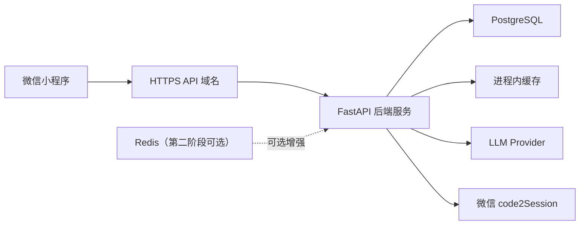

# 小程序正式上线架构与部署方案

> 文档定位：用于指导 Claread透读 从“本地联调 / 单机闭环”过渡到“可正式上线、可登录、可同步”的小程序产品架构。  
> 生效范围：覆盖微信登录、云端数据真源、词典数据部署、缓存策略、后端部署与正式环境边界。  
> 关联文档：
> - [小程序联调与用户体验开发设计文档](./mini-program-integration-and-ux-design.md)
> - [TECD3 本地词典接入方案](./tecd3-local-dictionary-integration.md)
> - [微信小程序产品与技术边界](./mini-program-boundaries.md)

## 1. 目标与结论

当前项目已经完成了本地历史、收藏、生词本、结果页回看和 `/dict` 词典服务骨架，但这些能力仍以“本地存储 + 开发期服务”为主。

如果产品要正式上线，必须把以下能力收口到服务端真源：

- 微信登录
- 云端历史记录
- 云端收藏
- 云端生词本
- 多设备同步

本方案的最终结论是：

- 正式业务数据库统一使用 `PostgreSQL`
- `TECD3` 离线解析后的词典数据也迁入 `PostgreSQL`
- 当前基于磁盘 JSON 的词典缓存方案废弃
- 缓存第一阶段使用进程内内存缓存即可
- `Redis` 作为第二阶段增强能力预留，不作为当前上线阻塞项
- 小程序登录使用微信原生能力发起，但最终业务认证与会话由后端维护

## 2. 为什么这样定

### 2.1 为什么不用本地 storage 作为正式真源

当前小程序本地 `storage` 适合：

- 输入草稿
- 最近阅读位置
- 临时恢复态
- 离线兜底

不适合：

- 登录后的用户资产长期保存
- 多设备同步
- 收藏与生词本的统一去重
- 云端回看

这是因为小程序原生存储本质上是本地缓存，而不是中心化真源。

官方参考：

- [wx.setStorageSync](https://developers.weixin.qq.com/miniprogram/dev/api/storage/wx.setStorageSync.html)
- [wx.getStorageSync](https://developers.weixin.qq.com/miniprogram/dev/api/storage/wx.getStorageSync.html)

### 2.2 为什么不用 SQLite 作为正式业务库

`SQLite` 是嵌入式文件型数据库，适合：

- 本地开发
- 单机小型工具
- 只读或低并发写入的数据

不适合承担你们当前已经明确要做的正式产品能力：

- 微信登录后的用户体系
- 云端历史记录
- 云端收藏
- 云端生词本
- 多设备同步
- 后续 RAG 数据管理

因此：

- `SQLite` 不作为正式业务主库
- 也不再作为词典线上主存储方案

### 2.3 为什么统一到 PostgreSQL

统一到 `PostgreSQL` 的直接收益：

- 用户资产、结果快照和词典数据都可进入统一数据治理体系
- 后续可扩展 `JSONB` 快照字段和 `pgvector` 检索能力
- 对登录、同步、查询、统计和未来 RAG 都更友好

推荐承担的内容：

- 用户与会话关联信息
- `analysis_records`
- `favorite_records`
- `vocabulary_book`
- `dict_entries`
- `dict_aliases`
- 后续 RAG 元数据与向量索引

## 3. 微信小程序官方能力边界

本方案需要遵守的小程序官方能力边界主要有 3 类。

### 3.1 登录

小程序原生提供的是“微信身份获取入口”，不是你们的完整业务认证体系。

原生能力：

- [`wx.login`](https://developers.weixin.qq.com/miniprogram/dev/api/open-api/login/wx.login.html)
- [`wx.checkSession`](https://developers.weixin.qq.com/miniprogram/dev/api/open-api/login/wx.checkSession.html)

服务端配套：

- [`auth.code2Session`](https://developers.weixin.qq.com/miniprogram/dev/api-backend/open-api/login/auth.code2Session.html)

这意味着：

- 小程序端负责拿 `code`
- 后端负责换取 `openid / session_key`
- 后端负责建立自己的 `user` 和 `session/token`

### 3.2 网络与域名

小程序请求正式后端时，必须使用：

- 合法 `request` 域名
- HTTPS
- 可被微信后台配置和校验的证书链

所以你们正式上线一定需要：

- 一个稳定公网 API 域名
- HTTPS 证书
- 小程序后台配置合法请求域名

### 3.3 生命周期与恢复

登录态、阅读态和分析中的恢复策略必须遵守小程序生命周期。

官方参考：

- [App 生命周期](https://developers.weixin.qq.com/miniprogram/dev/reference/api/App.html)
- [页面生命周期](https://developers.weixin.qq.com/miniprogram/dev/framework/app-service/page-life-cycle.html)

这意味着：

- 本地仍然需要保留草稿、恢复态和短期缓存
- 但正式资产必须以云端为真源

## 4. 正式上线推荐架构

解释：

- 小程序只负责 UI、登录发起、本地缓存和页面恢复
- 后端统一承接 `/analyze`、`/dict`、认证和用户资产 API
- `PostgreSQL` 作为业务与词典的正式主库
- `Redis` 为第二阶段可选增强，不作为首发阻塞项

## 5. 登录与认证方案

### 5.1 推荐登录流

1. 小程序调用 `wx.login`
2. 小程序把 `code` 发送到后端 `/auth/wechat/login`
3. 后端调用 `auth.code2Session`
4. 后端创建或更新用户
5. 后端签发业务 `session` 或 `JWT`
6. 小程序后续请求统一携带业务认证信息

### 5.2 后端职责

后端需要维护：

- 用户主键 `user_id`
- `openid`
- 会话表或 token 策略
- 会话过期与刷新
- 业务接口鉴权

前端不应维护：

- `session_key`
- 用户身份真源
- 权限规则

### 5.3 当前项目的落地建议

**状态更新（2026-04-07）**：`/auth/wechat/login`、`/auth/session/logout`、`/auth/session/me` 后端已实现。
前端 `getAuthHeaders()` 和登录 store 仍需接入（Phase C）。

- `/auth/wechat/login` ✅ 后端已实现
- 前端登录 store → Phase C
- `Authorization` header 注入 → Phase C

## 6. 数据模型建议

### 6.1 核心业务表

推荐最小业务表：

- `users`
- `user_sessions`
- `analysis_tasks`
- `analysis_task_events`
- `analysis_records`
- `user_credit_accounts`
- `user_credit_ledger`
- `favorite_records`
- `vocabulary_book`

### 6.2 词典表

推荐最小词典表：

- `dict_entries`
- `dict_aliases`

### 6.3 推荐结构

#### `users`

- `id`
- `openid`
- `unionid`（可空）
- `nickname`（可空）
- `avatar_url`（可空）
- `created_at`
- `updated_at`

#### `user_sessions`

- `id`
- `user_id`
- `session_token`
- `expires_at`
- `created_at`
- `last_seen_at`

#### `analysis_records`

- `id`
- `user_id`
- `task_id`
- `source_text`
- `request_payload_json`
- `render_scene_json`
- `page_state_snapshot`
- `is_favorited`
- `created_at`
- `updated_at`

说明：

- `render_scene_json` 推荐用 `JSONB`
- 历史回看默认读取快照，不自动重跑 `/analyze`
- 分析请求一提交就应创建记录，`analysis_records` 既承担“结果快照”，也承担“历史页中的处理中卡片”
- `analysis_status` 建议扩展为 `queued / running / succeeded / failed / cancelled / expired`

#### `analysis_tasks`

- `id`
- `user_id`
- `analysis_record_id`
- `idempotency_key`
- `request_fingerprint`
- `status`
- `worker_token`
- `queue_name`
- `attempt_no`
- `failure_code`
- `failure_message`
- `usage_summary_json`
- `quota_cost_points`
- `queued_at`
- `started_at`
- `finished_at`
- `created_at`
- `updated_at`

约束建议：

- `UNIQUE (user_id, idempotency_key)`：保证同一次点击或同一次重试请求不会重复创建任务
- `UNIQUE (user_id) WHERE status IN ('queued', 'running', 'finalizing')`：保证同一用户同一时间只有一个活跃 analyze 任务
- `UNIQUE (analysis_record_id)`：一个任务只服务一条结果记录

说明：

- `analysis_tasks` 是执行控制平面，负责排队、幂等、并发控制、失败重试与额度结算
- `analysis_records` 是用户资产平面，负责历史回看、收藏、生词本引用与结果快照
- 两者拆开后，既能做“处理中可回看”，也不会把执行态和展示态混成一张难维护的大表

#### `analysis_task_events`

- `id`
- `task_id`
- `event_type`
- `event_payload_json`
- `created_at`

事件建议至少覆盖：

- `task_submitted`
- `task_deduplicated`
- `task_queued`
- `task_started`
- `llm_stage_started`
- `llm_stage_finished`
- `task_succeeded`
- `task_failed`
- `quota_deducted`
- `quota_refund_skipped`

作用：

- 为“用户提交后退出小程序，回来还能追溯任务过程”提供审计基础
- 为后续排查超时、重复扣费、异常失败、模型成本异常提供证据链

#### `user_credit_accounts`

- `user_id`
- `daily_free_points`
- `daily_used_points`
- `bonus_points`
- `last_reset_on`
- `policy_version`
- `created_at`
- `updated_at`

说明：

- `daily_free_points` 是每日重置额度
- `bonus_points` 是活动赠送、人工补偿、邀请码奖励等长期额度
- 两类余额必须分开存，不能把“每日重置”与“赠送余额”揉成一个字段

#### `user_credit_ledger`

- `id`
- `user_id`
- `task_id`
- `entry_type`
- `points`
- `bucket_type`
- `balance_after`
- `metadata_json`
- `created_at`

`entry_type` 建议包括：

- `daily_grant`
- `bonus_grant`
- `analysis_deduct`
- `manual_adjust`
- `refund`

说明：

- 所有额度变化都走 append-only ledger，余额表只是快照
- 这样既能支持“每天 50 次”，也能支持未来按 token 折算积分
- 失败任务默认不扣减；如果未来引入预占额度，也必须在失败时自动冲正

#### `favorite_records`

- `id`
- `user_id`
- `analysis_record_id`
- `created_at`

约束：

- `UNIQUE (user_id, analysis_record_id)`

#### `vocabulary_book`

- `id`
- `user_id`
- `analysis_record_id`
- `word`
- `lemma`
- `phonetic`
- `part_of_speech`
- `meaning`
- `tags_json`
- `exchange_json`
- `source_provider`
- `mastered`
- `created_at`
- `updated_at`

约束建议：

- `UNIQUE (user_id, lemma)` 优先
- 如果 `lemma` 为空，可回退到 `word`

## 7. TECD3 迁移方案

### 7.1 最终方向

`TECD3` 不参与运行时查询，只作为离线解析源。

正式方案改为：

- `TECD3.mdx / TECD3.mdd`
- 导入 `PostgreSQL`
- `/dict` 从 `PostgreSQL` 查询

### 7.2 为什么不保留 SQLite 线上主方案

如果线上已经使用：

- `PostgreSQL` 存业务数据
- 未来还会有 RAG

那么继续让词典单独使用 `SQLite` 会带来：

- 三套存储边界混乱
- 备份与迁移链路分裂
- 查询、监控和扩展方式不一致

### 7.3 推荐词典表结构

#### `dict_entries`

- `id` `BIGSERIAL PRIMARY KEY`
- `source` `TEXT`
- `headword` `TEXT`
- `normalized_headword` `TEXT`
- `phonetic` `TEXT`
- `primary_pos` `TEXT`
- `short_meaning` `TEXT`
- `meanings_json` `JSONB`
- `examples_json` `JSONB`
- `phrases_json` `JSONB`
- `raw_html` `TEXT`
- `display_quality` `TEXT`

索引建议：

- `UNIQUE INDEX idx_dict_entries_lookup ON dict_entries (source, normalized_headword)`

#### `dict_aliases`

用于处理：

- `u.s.` -> `us`
- `u.k.` -> `uk`
- 连字符或空格变体

### 7.4 `/dict` 查询顺序

推荐顺序：

1. normalize query
2. alias 映射
3. exact word hit
4. not found
5. not found

`phrase_gloss` 不再进入 `/dict` 主查询路径。

## 8. 缓存方案

### 8.1 当前决策

当前不把 `Redis` 作为上线阻塞项。

第一阶段缓存方案：

- `L1`: FastAPI 进程内内存缓存
- 主数据真源：`PostgreSQL`

第二阶段增强：

- 引入 `Redis`

### 8.2 为什么先不上 Redis

原因不是 Redis 不好，而是当前更优先的是：

- 登录
- 云端用户资产
- PostgreSQL 真源
- `TECD3` 导入

在这些还没建立前，先上 Redis 的收益不高，且会增加部署复杂度。

### 8.3 Redis 在什么情况下再接入

当出现以下情况之一时，Redis 应进入第二阶段：

- 多实例部署
- `/dict` 热点查询明显增多
- 会话管理需要共享缓存
- `/analyze` 需要短时去重或幂等缓存

### 8.4 当前必须废弃的旧方案

当前 [cache.py](C:/Users/nanpr/miniprogram/interpretation-of-english-articles/server/app/services/dictionary/cache.py) 使用：

- L1 内存缓存
- L2 磁盘 JSON 文件缓存

其中 `server/.cache/dictionary/*.json` 来自旧 `dictionaryapi.dev` 路线，不适合正式方案。

正式迁移要求：

- 废弃 JSON 文件缓存
- 保留或重写 L1 内存缓存
- 如果后续接 Redis，再补 L2

## 9. 后端 API 收敛建议

正式上线阶段推荐最小 API：

- `POST /analyze`
- `GET /dict`
- `POST /auth/wechat/login`
- `POST /auth/session/refresh`（可选）
- `GET /records`
- `GET /records/{id}`
- `POST /records`
- `DELETE /records/{id}`
- `GET /favorites`
- `POST /favorites`
- `DELETE /favorites/{analysis_record_id}`
- `GET /vocabulary`
- `POST /vocabulary`
- `PATCH /vocabulary/{id}`
- `DELETE /vocabulary/{id}`

### 9.1 `/analyze` 要升级为“提交任务”语义

当前后端 `POST /analyze` 仍是同步直出 `RenderSceneModel`，这不适合小程序正式链路，原因有三点：

- LLM 解析耗时长，用户切后台、退页、弱网时会丢失上下文
- 同步请求无法天然承载“单用户单任务”“幂等去重”“失败不扣额度”
- 历史记录与执行过程割裂，无法把“处理中”稳定展示到记录页

正式方案建议改为：

1. 小程序提交 analyze 请求时，后端立即创建 `analysis_record + analysis_task`
2. 接口快速返回 `202 Accepted`
3. 小程序使用 `task_id / record_id` 轮询任务状态
4. 任务完成后，结果快照写回 `analysis_records.render_scene_json`
5. 历史页和结果页都只读 `analysis_records` 真源，不自动重跑

建议的正式接口：

- `POST /analysis-tasks`
- `GET /analysis-tasks/{task_id}`
- `GET /analysis-tasks/current`
- `POST /analysis-tasks/{task_id}/retry`
- `GET /records?include_processing=true`
- `GET /me/quota`

兼容建议：

- 当前同步 `POST /analyze` 可保留为本地调试或回归测试入口
- 小程序正式环境不要再直接等待 `/analyze` 返回最终结果

### 9.2 幂等与“单用户单任务”控制

这部分要同时防两类重复：

- 同一次点击被前端重复发送
- 同一用户在前一个任务未完成时再次发起新任务

推荐策略：

#### 前端

- 每次点击“开始解析”前先生成 `client_record_id`
- 同一次提交再生成 `idempotency_key`
- loading 态期间禁用再次提交按钮
- 结果页、历史页、App 恢复时始终以 `task_id / record_id` 查询当前状态，不重发原始 analyze 请求

#### 后端

- 请求进入后先对 `text + reading_goal + reading_variant + source_type + extended` 做归一化并生成 `request_fingerprint`
- 在一个数据库事务里先查 `(user_id, idempotency_key)` 是否已存在
- 若已存在，直接返回已有 `task_id / record_id / status`，不重复入队
- 若不存在，再检查该用户是否已有 `queued / running / finalizing` 的活跃任务
- 若已有活跃任务，返回 `409 ACTIVE_TASK_EXISTS`，并附带当前活跃 `task_id / record_id`
- 若没有活跃任务，才创建新任务并入队

为什么要同时保留 `idempotency_key` 和 `request_fingerprint`：

- `idempotency_key` 解决“同一次点击重发”
- `request_fingerprint` 解决“内容相同但前端误生成了新 key”时的二次校验与风控分析

### 9.3 任务生命周期与可追溯性

建议把 analyze 生命周期收敛成一套稳定状态机：

- `queued`
- `running`
- `finalizing`
- `succeeded`
- `failed`
- `cancelled`
- `expired`

推荐节点：

1. `task_submitted`
2. `task_queued`
3. `task_started`
4. `vocabulary_agent_started`
5. `grammar_agent_started`
6. `translation_agent_started`
7. `usage_collected`
8. `task_succeeded` 或 `task_failed`
9. `quota_deducted` 或 `quota_refund_skipped`

记录规则：

- `analysis_records` 保存面向用户的快照与最终状态
- `analysis_task_events` 保存过程审计
- `analysis_tasks.usage_summary_json` 保存聚合 token 使用量与模型信息
- 任务失败时必须写 `failure_code / failure_message`，不能只丢日志

这样设计后，即便用户在 loading 中退出小程序：

- 任务仍可继续执行
- 历史记录页能看到“处理中 / 失败 / 已完成”
- 结果页恢复时能通过 `record_id` 找回对应任务状态

### 9.4 额度、次数与积分的推荐方案

你们当前的业务要求其实包含两套约束：

- 产品层：前期给每个用户每天 50 次免费调用
- 成本层：不同任务真实 token 消耗差异很大，未来可能要按成本折算

推荐不要在数据库里只保存“今日已用次数”，而是直接落地成“积分账户 + 账本”，再由策略层决定如何展示成“50 次/天”。

建议策略：

#### 面向用户的展示

- 默认文案仍显示“今日免费解析 50 次”
- 赠送额度单独显示为“额外积分”或“奖励额度”
- 不把每日免费额度和赠送额度混在一个剩余数字里

#### 面向后端的计费

- 每次任务成功后，基于 `usage_summary_json.total_tokens` 计算 `cost_points`
- 扣减顺序建议为：`daily_free_points -> bonus_points`
- 任务失败不扣减
- 如果未来要做预占额度，失败时必须自动冲正

#### MVP 阶段的保守落地

为了避免一开始就把复杂 token 计费暴露给用户，建议两阶段推进：

1. `Launch 阶段`
   - 用户视角按“成功一次扣 1 次”运行
   - 后端同时记录真实 token 和 shadow points，但先不影响用户展示
2. `Refine 阶段`
   - 根据真实成本数据，把 `cost_points` 从固定 1 切到按 token 折算
   - 前端展示从“次数”升级为“积分 + 预计可解析次数”

这样做的好处：

- 现在就能满足“每天 50 次、失败不扣、奖励单独送”的业务要求
- 未来切到 Manus 类积分模型时，不需要重做表结构和对账逻辑

### 9.5 配额校验与扣减时机

推荐时机：

- `提交前校验是否有可用额度`
- `任务成功后再真正扣减`

不推荐：

- 提交时直接扣减且失败不返还
- 只在前端本地算次数

原因：

- 你们已经要求“执行失败不能扣减次数”
- 单用户单任务前提下，不需要复杂的多任务额度预占
- 额度真源必须在服务端，否则很容易被绕过

### 9.6 推荐实施顺序

P0：

- 扩展 `analysis_records.analysis_status`
- 新增 `analysis_tasks`
- 新增 `analysis_task_events`
- 新增 `user_credit_accounts`
- 新增 `user_credit_ledger`
- 把 token usage 从 LangSmith/agent usage 汇总落到任务表

P1：

- 新增 `POST /analysis-tasks`
- 新增 `GET /analysis-tasks/{id}`
- 历史记录接口支持返回处理中记录
- 前端结果页改为“提交任务 + 轮询”

P2：

- 增加 `GET /me/quota`
- 接入每日免费额度 + 奖励额度
- 先按固定 1 次扣减，同时记录 shadow points

P3：

- 根据真实成本数据切换到 token -> points 折算
- 增加人工补偿、活动赠送、邀请码奖励后台入口

## 10. 部署建议

### 10.1 推荐部署拓扑

推荐部署到可公网 HTTPS 暴露的容器环境，例如：

- 腾讯云云托管 / CloudBase Run
- 或等价容器平台

推荐资源：

- 1 个 FastAPI 服务
- 1 个托管 PostgreSQL
- 1 个可选 Redis（第二阶段）

### 10.2 小程序侧必须完成的部署配置

- 配置正式 `request` 合法域名
- 配置 HTTPS
- 确认分享路径与域名一致
- 预留登录失败、会话过期、弱网恢复文案

### 10.3 后端上线检查

- 健康检查接口
- 环境变量与模型配置
- 数据库迁移脚本
- `TECD3` 导入脚本
- 日志与错误监控
- 小程序正式域名联调

## 11. 分阶段实施顺序

### Phase 1：正式数据架构落地

- 确定 `PostgreSQL`
- 设计业务表和词典表
- 导入 `TECD3`
- 废弃 JSON 文件缓存

### Phase 2：登录与会话

- 小程序接入 `wx.login`
- 后端建立 `/auth/wechat/login`
- 业务 token/session 注入

### Phase 3：云端资产

- 云端 `analysis_records`
- 云端 `favorite_records`
- 云端 `vocabulary_book`

### Phase 4：同步与恢复

- 本地缓存与云端真源边界收敛
- 多设备同步
- 前后台恢复与会话刷新

### Phase 5：缓存增强

- 根据实际压力引入 `Redis`
- 优化 `/dict` 和 session 热点路径

## 12. P0 开发前置清单

在正式进入登录、云端资产和部署开发前，必须先完成下面这组收口项。  
这不是新的路线图，而是为了避免一边实现、一边修改数据边界导致返工。

### 12.1 数据库与模型定稿

- 明确 `users`、`user_sessions`、`analysis_records`、`favorite_records`、`vocabulary_book`、`dict_entries`、`dict_aliases` 的最终字段
- 明确 `analysis_tasks`、`analysis_task_events`、`user_credit_accounts`、`user_credit_ledger` 的最终字段
- 明确主键、唯一键、外键和索引策略
- 明确 `analysis_records.render_scene_json`、`request_payload_json` 是否统一使用 `JSONB`
- 明确 `vocabulary_book` 是否按 `user_id + lemma` 去重
- 明确 `analysis_records` 与 `analysis_tasks` 的一对一关系及状态同步规则

### 12.2 认证协议定稿

- 明确 `/auth/wechat/login` 的请求与响应结构
- 明确使用 `session token` 还是 `JWT`
- 明确前端请求头格式，例如 `Authorization: Bearer ...`
- 明确会话过期、刷新和失效策略
- 明确哪些接口允许匿名访问，哪些接口必须登录

### 12.3 开发期本地资产导入策略定稿

当前小程序尚未正式上线，因此这里不是“线上数据迁移”，而是要明确：

- 是否保留“开发期本地历史 / 收藏 / 生词本导入到云端”的调试能力
- 如果保留，该导入能力是否只在开发环境开放
- 本地资产导入时的去重规则是什么
- “云端为真源，本地为缓存”的最终优先级如何定义

### 12.4 API Contract 定稿

- `/dict`：切换为 PostgreSQL 词典真源后的返回结构最终确认
- `/analysis-tasks`：创建、查询、重试、冲突返回结构确认
- `/records`：列表、详情、创建、删除、分页字段确认
- `/favorites`：增删查协议确认
- `/vocabulary`：增删改查协议确认
- `/auth/*`：登录、刷新、退出协议确认
- `/me/quota`：每日额度、奖励额度、扣减明细的返回结构确认

### 12.5 部署准备定稿

- 明确正式运行环境：容器平台、PostgreSQL 服务、可选 Redis
- 明确 API 域名、HTTPS 证书和小程序合法请求域名配置
- 明确环境变量命名与注入方式
- 明确数据库迁移、`TECD3` 导入、回滚和健康检查流程

当前已落地的本地开发基线文件：

- 初始 schema migration：
  [server/db/migrations/0001_initial_schema.sql](C:/Users/nanpr/miniprogram/interpretation-of-english-articles/server/db/migrations/0001_initial_schema.sql)
- 本地 PostgreSQL + Redis 编排：
  [docker-compose.local.yml](C:/Users/nanpr/miniprogram/interpretation-of-english-articles/docker-compose.local.yml)
- 后端本地环境变量模板：
  [server/.env.example](C:/Users/nanpr/miniprogram/interpretation-of-english-articles/server/.env.example)

### 12.6 开发节奏建议

- 先做 `schema + migration`
- 再做 `analysis task center + quota ledger`
- 再做 `TECD3 -> PostgreSQL`
- 再做 `/dict` 查询切换
- 再做微信登录与业务 session
- 最后做云端历史、收藏、生词本、异步 analyze 与同步

### 12.7 与 UI/UX 并行时的约束

- UI/UX 可以继续并行推进结果页、历史页、词典弹层优化
- 但登录页、个人中心、云端历史页交互不要先做复杂视觉重构
- 等认证协议和云端数据模型定稿后，再做完整用户页体验收口

## 13. 当前对执行的直接影响

从现在开始，后续开发应遵守：

- 不再把小程序本地 storage 视为最终真源
- 不再把 SQLite 视为正式词典线上主存储
- 不再扩展磁盘 JSON 缓存方案
- 新的登录、收藏、生词本、历史记录实现都要以 PostgreSQL 为最终归宿

## 14. 文档维护与收口规则

`docs/architecture/` 当前只保留 4 份主文档：

- [mini-program-integration-and-ux-design.md](./mini-program-integration-and-ux-design.md)
  - 用户主链路、当前实现状态、Phase A/B/C/D 路线
- [tecd3-local-dictionary-integration.md](./tecd3-local-dictionary-integration.md)
  - 词典、短语、lexer、生词本相关执行细则
- [mini-program-boundaries.md](./mini-program-boundaries.md)
  - 小程序原生能力边界与架构结论
- [production-architecture-and-deployment-plan.md](./production-architecture-and-deployment-plan.md)
  - 正式上线架构、数据库、认证、部署与 P0 清单

维护原则：

- 已经实现、且不再需要路线指导的事项，优先在主文档中写“当前结论”，不再额外拆新文档
- 新能力如果只是现有主线的延伸，应补到对应主文档，而不是新增平行文档
- 若后续确实新增文档，必须先更新 [docs/README.md](../README.md) 并说明其不可被哪份现有文档覆盖

## 15. 需要同步更新的文档

本方案落地后，以下文档需要和它保持一致：

- [mini-program-integration-and-ux-design.md](./mini-program-integration-and-ux-design.md)
- [tecd3-local-dictionary-integration.md](./tecd3-local-dictionary-integration.md)
- [mini-program-boundaries.md](./mini-program-boundaries.md)
- [docs/README.md](../README.md)
