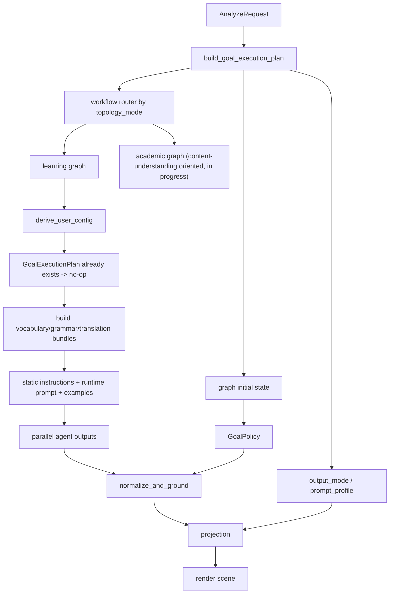

# 差异化输出执行架构设计

> 文档定位：定义 Workflow V3 下差异化输出的当前执行架构、已实现边界和后续推进顺序。  
> 当前阶段：开发重心已从 `daily_reading + intermediate_reading` baseline 调优切换到 `academic v1` 完整流程落地；`academic` 的产品方向已明确为“内容理解优先”，不再属于“最后再做”的远期事项。  
> 本文只描述代码级执行设计，不展开具体 prompt 文案和最终 few-shot 内容。

## 1. 当前结论

当前系统已经明确采用下面这套架构原则：

1. `GoalExecutionPlan` 是运行时唯一真相源。
2. `GoalPolicy` 是 normalize 阶段的唯一硬策略输入。
3. `daily_reading` 与 `exam` 共用 `learning` 拓扑。
4. `academic` 单独建模为 `academic` 拓扑，且方向上不是 `learning` 的高阶变体，而是独立的内容理解模式。
5. agent 的静态 `instructions` 只保留长期稳定的角色约束与硬规则。
6. prompt 差异、few-shot 差异、密度差异统一通过 runtime 计划注入。
7. `kaoyan` 与 `tem` 已是当前 exam 场景的正式后端枚举，exam variant 集合已按现行产品定义收敛。

这意味着系统已经从“旧的场景规则包 + 大 prompt 分叉”收敛为“单一执行计划 + 分层 prompt 注入”。

## 2. 当前目标与范围

当前优先级已经确定：

1. 先补齐 `academic v1` 的最小可联调闭环。
2. 统一 `academic` 在 `/analyze` 与 `/analysis-tasks` 上的执行入口和错误语义。
3. 落地 `academic` 独立 workflow、独立语义产物、独立 projection 策略。
4. `academic v1` 稳定后，再回到 `daily_reading` 与 `exam` 的扩展调优。

当前不做：

1. 把 `academic` 直接视为已稳定支持能力并全面开放。
2. RAG few-shot 注入。
3. 继续沿用“词汇 / 语法 / 翻译”三 agent 结构，只做 prompt 层面的学术化改写。
4. exam_tag 参与筛选或排序。

当前已确认但尚未补齐的一致性问题：

1. `/analyze` 对 academic 返回受控 `501`。
2. 登录态主链路走 `/analysis-tasks`，academic 当前会在 worker 内失败，并以 `422 TASK_TERMINATED` 返回。
3. `example strategy` 还没有 academic 专属 baseline，会默认落回非 academic 示例集合。
4. `output_mode="academic_scene"` 已进入 execution plan，但 projection 仍只产出统一的 `RenderSceneModel`。

## 3. 三类 reading_goal 的执行差异

### 3.1 daily_reading

定位：帮助用户在日常阅读中提升英语理解与语言感知。

执行特征：

- 走 `learning` 拓扑
- vocabulary 聚焦高价值词、短语、语境义
- grammar 聚焦直白解释与句子理解
- translation 聚焦自然、顺畅、帮助理解
- normalize 做克制密度控制

它主要影响：

- prompt 侧重点
- few-shot 示例
- normalize 策略

它当前不影响：

- workflow 拓扑
- 前端输出协议

### 3.2 exam

定位：围绕考试目标组织解析重点。

执行特征：

- 仍走 `learning` 拓扑
- vocabulary 解释向考试相关用法和高频考点倾斜
- grammar 强调“这个考试在考什么”
- translation 兼顾理解与应试句法映射
- 词汇卡片通过查词接口展示对应 variant 的 `exam_tag`（LLM 不输出该字段）

它主要影响：

- vocabulary / grammar / translation 的 runtime policy
- baseline examples 之外的 few-shot 选择
- 前端词卡展示增强

它当前不影响：

- workflow 主拓扑
- render scene 主协议

### 3.3 academic

定位：帮助用户快速理解论文、学术文献、专业材料。

设计原则：

- 这不是“更难的英语学习”，而是“以内容理解为目标的学术解析”
- 语法解释会弱化，结构理解、术语理解、论证关系会强化
- 用户的核心诉求通常不是“学会这句语法”，而是“确认作者到底在说什么、论证怎么推进、哪些地方直译会带来理解偏差”

当前代码状态：

- planner 明确产出 `topology_mode="academic"`
- workflow router 已实现 academic 分支
- academic graph 已实现完整拓扑
- 未登录直连 `/analyze` 时，academic 已可正常返回结果
- 登录后走 `/analysis-tasks` 时，academic 已可正常执行
- example strategy 复用现有 vocabulary/grammar/translation 示例集合
- `output_mode="academic_scene"` 已进入 execution plan，projection 已产出包含 academic 字段的 `RenderSceneModel`

当前文档口径应明确为：

- academic 在架构上已经单独建模
- academic 已进入当前主开发路线，不再是"最后再做"的事项
- academic v1 已完成最小可联调闭环，可在微信小程序开发工具中选择 academic 模式进行解析并看到完整的 academic 结果页

academic 的大致产品方向应明确为：

- 以“帮助用户读懂文献内容”为第一目标，而不是以“帮助用户学习英语知识点”为第一目标
- 术语、概念、论证关系、段落功能、结论与限制，优先级高于普通词汇学习
- 逐句翻译仍然保留，但在 academic 中应降级为“参考层”；更重要的是对句意、逻辑和作者意图的解释性改写
- 语法说明只在它真正妨碍理解时出现，不再把显性语法教学作为主要输出

academic 的架构方向应明确为：

- academic 不应继续绑定现有 `vocabulary_agent + grammar_agent + translation_agent` 三分法
- academic 应拥有独立 workflow，节点按“术语/概念”“论证/结构”“解释/释义”“全文综合”重新组织
- academic 不应被迫复用 learning 的 annotation 类型作为主表达方式
- academic projection 不应默认只映射为 `grammar_note` / `sentence_analysis` 这类学习型入口

academic v1 的建议输出重心：

- `term_note`：术语、缩写、变量、方法名、概念对立
- `logic_note`：转折、让步、限定、因果、对比、假设、结论
- `paragraph_role`：定义、背景、问题提出、方法、证据、结果、限制、过渡
- `interpretation_note`：解释“这句话真正想表达什么”，以及“为什么不能只按字面直译理解”
- `document_summary`：研究问题、方法、核心结论、限制（可按 v1 范围裁剪）

这不代表 academic v1 必须一次性做完整论文理解系统；但至少要确保主链路的组织方式已经从“语言点标注”切换为“内容理解辅助”。

## 4. 当前核心执行模型

当前只保留两个核心对象。

### 4.1 AnalyzeRequest

表达用户原始选择：

- `reading_goal`
- `reading_variant`
- `source_type`

它不携带派生策略。

### 4.2 GoalExecutionPlan

当前实现中的核心字段如下：

```python
GoalExecutionPlan(
    goal_id,
    variant_id,
    topology_mode,   # "learning" | "academic"
    output_mode,     # "learning_scene" | "academic_scene"
    prompt_profile,
    few_shot_mode,   # "baseline" | "manual" | "rag"
    policy,
)
```

职责如下：

- `topology_mode`：决定走哪套 workflow
- `output_mode`：决定 projection 目标协议
- `prompt_profile`：统一对外暴露当前场景标签
- `few_shot_mode`：决定示例来源策略
- `policy`：供 normalize 执行硬约束

### 4.3 GoalPolicy

当前实现中的硬策略对象：

```python
GoalPolicy(
    annotation_density,
    vocabulary_focus,
    grammar_focus,
    translation_focus,
)
```

它是代码消费对象，不是 prompt 文本对象。

## 5. 当前端到端数据流

当前代码中的数据流如下：



关键点：

1. `GoalExecutionPlan` 在 workflow 入口计算一次。
2. 该 plan 会注入 graph 初始 state。
3. `derive_user_config_node` 只在 plan 缺失时补算，正常路径下不再重复生成。
4. prompt、normalize、projection 都从同一个 plan 读取。

这保证了当前架构下的单一真相源。

## 6. system prompt 与 runtime prompt 的边界

当前明确采用下面这条边界：

### 6.1 静态 system prompt 负责

- agent 角色定义
- 输出 schema 契约
- 强硬禁止项
- 锚点和字段合法性边界

这些内容在 agent 类中长期稳定保留。

### 6.2 runtime prompt 负责

- 当前 `reading_goal` / `reading_variant`
- 当前场景的 task policy
- baseline / manual / rag few-shot
- 本次输入句子

这意味着：

- 稳定规则不会在每次请求重复发送
- baseline 之外的差异可以独立替换
- agent 本身不会空洞化

## 7. few-shot 的当前状态

当前 few-shot 机制已经具备可扩展骨架，但还不是完整产品能力。

当前行为：

- `few_shot_mode = "baseline"`：注入 baseline 示例
- `few_shot_mode = "manual"`：当前不注入示例，占位
- `few_shot_mode = "rag"`：当前不注入示例，占位

这表示：

- `few_shot_mode` 已经是真开关，不再只是标签
- 但 `manual` / `rag` 还没有独立 provider

后续实现顺序应为：

1. 先稳定 baseline example set
2. 再补 manual example source
3. 最后引入 rag example retrieval

## 8. normalize 的硬优先级

当前已经定死下面的优先级：

1. schema 合法性
2. `GoalPolicy`
3. prompt soft hint
4. 模型自由发挥

其中：

- `annotation_density` 的执行权只属于 normalize
- prompt 只能表达“建议少标/均衡/偏密”，不能越过 normalize 的上限裁决

这保证了业务策略和模型输出之间的控制边界。

## 9. exam variant 与 exam_tag 约定

> ⚠️ 更新（2026-04-13）：`VocabHighlight` 不再由 LLM 输出 `exam_tags` 字段。exam_tags 仅由词典数据库持有，用于查词展示。

当前约定如下：

- `gaokao` -> `exam_tag=[gaokao]`
- `cet` -> `exam_tag=[cet4, cet6]`
- `kaoyan` -> `exam_tag=[kaoyan]`
- `tem` -> `exam_tag=[tem4, tem8]`
- `ielts_toefl` -> `exam_tag=[ielts, toefl]`

数据流说明：

- **LLM 输出**：`VocabHighlight` schema 不含 `exam_tags` 字段
- **词典数据库**：保存词条的 `exam_tags`，用于过滤和展示
- **前端展示**：词汇卡片的 `exam_tags` 来自查词接口，不来自 LLM annotation
- 当前 `exam_tag` 不参与筛选，不建索引

额外说明：

- 数据库内部考研英语标签已统一为 `kaoyan`
- 前端展示文案：`kaoyan` 渲染为”考研英语”，`tem` 渲染为”专业英语 (TEM4/8)”

## 10. 当前代码结构

当前服务端目录已经按职责收敛为：

```text
server/app/services/analysis/
  planning/
    goal_planner.py
    goal_views.py
  prompting/
    prompt_strategy.py
    prompt_composer.py
    example_strategy.py
    strategy_builder.py
  preprocess/
    input_preparation.py
  postprocess/
    normalize_and_ground.py
    projection.py
    draft_validators.py
  runtime/
    runners.py
```

workflow 侧：

```text
server/app/workflow/
  analyze.py              # workflow router
  learning_workflow.py    # daily + exam
  academic_workflow.py    # academic workflow（独立内容理解拓扑，v1 开发中）
  analyze_nodes.py
  analyze_state.py
```

这套结构已经足够支撑后续 prompt 调优，不需要再次做大规模目录重组。

## 11. 当前实现状态评估

### 已完成

1. legacy `user_rules` 已移除。
2. `GoalExecutionPlan` 已成为运行时唯一真相源。
3. plan 已不再在 graph 内重复生成。
4. normalize 已只依赖 `GoalPolicy`。
5. agent 静态 instructions 已完成瘦身。
6. baseline few-shot 已移出 agent 内联指令。
7. workflow 已按 topology 具备分流入口。
8. `kaoyan` 与 `tem` 已与当前前端配置、planner、prompt policy 对齐为正式 exam variant。
9. `academic` graph 本体已实现。
10. academic 专属 draft schema / agent node 设计已完成。
11. `academic_scene` projection 已实现。
12. academic 前后端统一错误语义已实现。

### academic v1 待实现

1. academic 专属 example strategy（当前复用 vocabulary/grammar/translation 示例集合）
2. `manual` few-shot provider
3. `rag` few-shot provider

### 当前明确约束

1. academic 是当前主开发能力，已完成最小可联调闭环
2. academic 请求当前不走 learning fallback
3. `/analyze` 与 `/analysis-tasks` 对 academic 的失败语义已统一
4. `daily_reading + intermediate_reading` baseline 调优不再是唯一主线，需给 academic v1 质量调优让位
5. academic v1 已实现为独立 workflow / schema / projection 模式，不是学习型标注协议的小改版

## 12. Academic v1 开发阶段的起点

从现在开始，进入开发阶段时优先做下面这件事：

### 当前主对象

`academic v1` 完整流程

### 设计原则

1. academic 的主任务是帮助用户理解内容，不是帮助用户系统学英语
2. academic 应采用独立 workflow，而不是复用 learning 的并行 agent 主干
3. academic 的输出协议应围绕“术语、逻辑、段落功能、解释性理解、全文综合”组织
4. 逐句翻译是 academic 的辅助层，不是 academic 页面唯一主轴
5. 是否复用外层 API 包装可以后置决定，但内部语义产物和 projection 目标必须独立

### 允许调整的内容

1. `academic_workflow.py` 与 workflow router 分流逻辑
2. `/analyze`、`/analysis-tasks` 的 academic 入口和错误语义
3. academic 专属 agent node、draft schema、normalized schema
4. `goal_views.py`、`prompt_strategy.py` 中的 academic runtime policy 表述
5. `example_strategy.py` 中的 academic baseline examples
6. `GoalPolicy` 对应的 academic 密度和侧重点
7. projection 是否扩展 `RenderSceneModel` 或引入独立 `academic_scene`

### 当前不允许调整的内容

1. 在 academic v1 未闭环前宣称 academic 已可稳定上线
2. 为了赶进度把 academic 强行 fallback 到 learning
3. 把 academic 实现成学习型标注协议的小改版
4. 未验证收益前同步开启 RAG / manual few-shot 两条支线
5. exam 变体策略

## 13. 下一阶段顺序

建议严格按下面顺序推进：

1. 增加 academic prompt baseline 与 example strategy
2. 建 academic v1 评测集并稳定输出
3. academic v1 稳定后，再恢复 `daily_reading` 与 `exam` 的扩展节奏

`daily_reading` 与 `exam` 后续建议顺序：

1. 回补 `daily_reading + intermediate_reading` baseline 评测与调优
2. 扩 `daily_reading` 的 `beginner_reading`
3. 扩 `daily_reading` 的 `intensive_reading`
4. 再做 `exam`
5. 最后再决定是否引入更重的 few-shot 能力（manual / rag）

## 14. 最终结论

这次重构之后，差异化输出架构已经收口到一个稳定状态：

- 单一执行计划
- 分层 prompt
- policy 驱动 normalize
- topology 可分流
- academic 已进入主开发阶段，且方向已明确为独立内容理解模式
- academic v1 已完成最小可联调闭环，可在微信小程序开发工具中选择 academic 模式进行解析并看到完整的 academic 结果页

因此这份文档现在应表达的不是"academic 以后再做"，也不是"academic 只是 learning 的学术版 prompt"，而是"academic 已经进入 v1 落地阶段，且已经以独立 workflow、独立语义产物、独立 projection 方向实现了最小闭环"。后续工作应先补齐 academic 的 prompt baseline 与 example strategy，再进入 academic 场景质量调优；`daily_reading` 与 `exam` 的扩展则顺延到 academic v1 稳定之后。
