# 差异化输出执行架构设计

> 文档定位：定义 Workflow V3 下差异化输出的当前执行架构、已实现边界和后续推进顺序。  
> 当前阶段：执行架构已收口，`daily_reading + intermediate_reading` 进入 baseline prompt 调优阶段。  
> 本文只描述代码级执行设计，不展开具体 prompt 文案和最终 few-shot 内容。

## 1. 当前结论

当前系统已经明确采用下面这套架构原则：

1. `GoalExecutionPlan` 是运行时唯一真相源。
2. `GoalPolicy` 是 normalize 阶段的唯一硬策略输入。
3. `daily_reading` 与 `exam` 共用 `learning` 拓扑。
4. `academic` 单独建模为 `academic` 拓扑，但当前仍是占位，不参与真实解析。
5. agent 的静态 `instructions` 只保留长期稳定的角色约束与硬规则。
6. prompt 差异、few-shot 差异、密度差异统一通过 runtime 计划注入。

这意味着系统已经从“旧的场景规则包 + 大 prompt 分叉”收敛为“单一执行计划 + 分层 prompt 注入”。

## 2. 当前目标与范围

当前优先级已经确定：

1. 先把执行架构做稳定。
2. 再只调 `baseline -> daily_reading + intermediate_reading`。
3. baseline 稳定后，再扩 `daily_reading` 其他 variant。
4. 然后再做 `exam`。
5. 最后再实现 `academic` 新拓扑和新 agent。

当前不做：

1. `academic` 真正解析实现。
2. RAG few-shot 注入。
3. 新 projection contract。
4. exam_tag 参与筛选或排序。

## 3. 三类 reading_goal 的执行差异

### 3.1 daily_reading

定位：帮助用户在日常阅读中提升英语理解与语言感知。

执行特征：

- 走 `learning` 拓扑
- vocabulary 聚焦高价值词、短语、语境义
- grammar 聚焦直白解释与句子理解
- translation 聚焦自然、顺畅、帮助理解
- normalize 做克制密度控制

它主要影响：

- prompt 侧重点
- few-shot 示例
- normalize 策略

它当前不影响：

- workflow 拓扑
- 前端输出协议

### 3.2 exam

定位：围绕考试目标组织解析重点。

执行特征：

- 仍走 `learning` 拓扑
- vocabulary 解释向考试相关用法和高频考点倾斜
- grammar 强调“这个考试在考什么”
- translation 兼顾理解与应试句法映射
- 词汇卡片通过查词接口展示对应 variant 的 `exam_tag`（LLM 不输出该字段）

它主要影响：

- vocabulary / grammar / translation 的 runtime policy
- baseline examples 之外的 few-shot 选择
- 前端词卡展示增强

它当前不影响：

- workflow 主拓扑
- render scene 主协议

### 3.3 academic

定位：帮助用户快速理解论文、学术文献、专业材料。

设计原则：

- 这不是“更难的英语学习”，而是“以内容理解为目标的学术解析”
- 语法解释会弱化，结构理解、术语理解、论证关系会强化

当前代码策略：

- planner 明确产出 `topology_mode="academic"`
- workflow router 已预留 academic 分支
- 但 academic graph 仍未实现
- 当前请求 academic 时，API 受控返回 `501`

这表示：

- academic 在架构上已经单独建模
- 但在业务能力上仍是占位，不应被视为已支持

## 4. 当前核心执行模型

当前只保留两个核心对象。

### 4.1 AnalyzeRequest

表达用户原始选择：

- `reading_goal`
- `reading_variant`
- `source_type`

它不携带派生策略。

### 4.2 GoalExecutionPlan

当前实现中的核心字段如下：

```python
GoalExecutionPlan(
    goal_id,
    variant_id,
    topology_mode,   # "learning" | "academic"
    output_mode,     # "learning_scene" | "academic_scene"
    prompt_profile,
    few_shot_mode,   # "baseline" | "manual" | "rag"
    policy,
)
```

职责如下：

- `topology_mode`：决定走哪套 workflow
- `output_mode`：决定 projection 目标协议
- `prompt_profile`：统一对外暴露当前场景标签
- `few_shot_mode`：决定示例来源策略
- `policy`：供 normalize 执行硬约束

### 4.3 GoalPolicy

当前实现中的硬策略对象：

```python
GoalPolicy(
    annotation_density,
    vocabulary_focus,
    grammar_focus,
    translation_focus,
)
```

它是代码消费对象，不是 prompt 文本对象。

## 5. 当前端到端数据流

当前代码中的数据流如下：

```mermaid
flowchart TD
    A["AnalyzeRequest"] --> B["build_goal_execution_plan"]
    B --> C["workflow router by topology_mode"]
    B --> D["graph initial state"]
    C --> E["learning graph"]
    C --> F["academic placeholder"]
    E --> G["derive_user_config"]
    G --> H["GoalExecutionPlan already exists -> no-op"]
    H --> I["build vocabulary/grammar/translation bundles"]
    I --> J["static instructions + runtime prompt + examples"]
    J --> K["parallel agent outputs"]
    D --> L["GoalPolicy"]
    K --> M["normalize_and_ground"]
    L --> M
    B --> N["output_mode / prompt_profile"]
    M --> O["projection"]
    N --> O
    O --> P["render scene"]
```



关键点：

1. `GoalExecutionPlan` 在 workflow 入口计算一次。
2. 该 plan 会注入 graph 初始 state。
3. `derive_user_config_node` 只在 plan 缺失时补算，正常路径下不再重复生成。
4. prompt、normalize、projection 都从同一个 plan 读取。

这保证了当前架构下的单一真相源。

## 6. system prompt 与 runtime prompt 的边界

当前明确采用下面这条边界：

### 6.1 静态 system prompt 负责

- agent 角色定义
- 输出 schema 契约
- 强硬禁止项
- 锚点和字段合法性边界

这些内容在 agent 类中长期稳定保留。

### 6.2 runtime prompt 负责

- 当前 `reading_goal` / `reading_variant`
- 当前场景的 task policy
- baseline / manual / rag few-shot
- 本次输入句子

这意味着：

- 稳定规则不会在每次请求重复发送
- baseline 之外的差异可以独立替换
- agent 本身不会空洞化

## 7. few-shot 的当前状态

当前 few-shot 机制已经具备可扩展骨架，但还不是完整产品能力。

当前行为：

- `few_shot_mode = "baseline"`：注入 baseline 示例
- `few_shot_mode = "manual"`：当前不注入示例，占位
- `few_shot_mode = "rag"`：当前不注入示例，占位

这表示：

- `few_shot_mode` 已经是真开关，不再只是标签
- 但 `manual` / `rag` 还没有独立 provider

后续实现顺序应为：

1. 先稳定 baseline example set
2. 再补 manual example source
3. 最后引入 rag example retrieval

## 8. normalize 的硬优先级

当前已经定死下面的优先级：

1. schema 合法性
2. `GoalPolicy`
3. prompt soft hint
4. 模型自由发挥

其中：

- `annotation_density` 的执行权只属于 normalize
- prompt 只能表达“建议少标/均衡/偏密”，不能越过 normalize 的上限裁决

这保证了业务策略和模型输出之间的控制边界。

## 9. exam variant 与 exam_tag 约定

> ⚠️ 更新（2026-04-13）：`VocabHighlight` 不再由 LLM 输出 `exam_tags` 字段。exam_tags 仅由词典数据库持有，用于查词展示。

当前约定如下：

- `gaokao` -> `exam_tag=[gaokao]`
- `cet` -> `exam_tag=[cet4, cet6]`
- `kaoyan` -> `exam_tag=[kaoyan]`
- `tem` -> `exam_tag=[tem4, tem8]`
- `ielts_toefl` -> `exam_tag=[ielts, toefl]`

数据流说明：

- **LLM 输出**：`VocabHighlight` schema 不含 `exam_tags` 字段
- **词典数据库**：保存词条的 `exam_tags`，用于过滤和展示
- **前端展示**：词汇卡片的 `exam_tags` 来自查词接口，不来自 LLM annotation
- 当前 `exam_tag` 不参与筛选，不建索引

额外说明：

- 数据库内部 `kaoyan` 已替换原 `gre` 作为考研英语标签
- 前端展示文案：`kaoyan` 渲染为”考研英语”，`tem` 渲染为”专业英语 (TEM4/8)”

## 10. 当前代码结构

当前服务端目录已经按职责收敛为：

```text
server/app/services/analysis/
  planning/
    goal_planner.py
    goal_views.py
  prompting/
    prompt_strategy.py
    prompt_composer.py
    example_strategy.py
    strategy_builder.py
  preprocess/
    input_preparation.py
  postprocess/
    normalize_and_ground.py
    projection.py
    draft_validators.py
  runtime/
    runners.py
```

workflow 侧：

```text
server/app/workflow/
  analyze.py              # workflow router
  learning_workflow.py    # daily + exam
  academic_workflow.py    # academic placeholder
  analyze_nodes.py
  analyze_state.py
```

这套结构已经足够支撑后续 prompt 调优，不需要再次做大规模目录重组。

## 11. 当前实现状态评估

### 已完成

1. legacy `user_rules` 已移除。
2. `GoalExecutionPlan` 已成为运行时唯一真相源。
3. plan 已不再在 graph 内重复生成。
4. normalize 已只依赖 `GoalPolicy`。
5. agent 静态 instructions 已完成瘦身。
6. baseline few-shot 已移出 agent 内联指令。
7. workflow 已按 topology 具备分流入口。

### 仍是占位

1. `academic` graph 本体
2. `manual` few-shot provider
3. `rag` few-shot provider
4. `academic_scene` projection

### 当前明确约束

1. academic 不是已支持能力
2. academic 请求当前应受控返回，不走 learning fallback
3. baseline prompt 调优只能先针对 `daily_reading + intermediate_reading`

## 12. Prompt 调优阶段的起点

从现在开始，进入 prompt 调优阶段时只做下面这件事：

### 调优对象

`baseline -> daily_reading + intermediate_reading`

### 允许调整的内容

1. `goal_views.py` 中的 baseline 场景文案
2. `prompt_strategy.py` 中的 runtime policy 表述
3. `example_strategy.py` 中的 baseline examples
4. `GoalPolicy` 对应的 baseline 密度和侧重点

### 当前不允许调整的内容

1. workflow 拓扑
2. academic 相关代码
3. projection 协议
4. 前端展示协议
5. exam 变体策略

## 13. 下一阶段顺序

建议严格按下面顺序推进：

1. 调 `daily_reading + intermediate_reading` baseline
2. 建 baseline 评测集并稳定输出
3. 扩 `daily_reading` 的 `beginner_reading`
4. 扩 `daily_reading` 的 `intensive_reading`
5. 再做 `exam`
6. 最后实现 `academic`

## 14. 最终结论

这次重构之后，差异化输出架构已经收口到一个稳定状态：

- 单一执行计划
- 分层 prompt
- policy 驱动 normalize
- topology 可分流
- academic 明确占位

因此系统现在已经满足进入 baseline prompt 调优阶段的前置条件。后续工作重点不再是继续改架构，而是开始用这套架构稳定 `daily_reading + intermediate_reading` 的实际输出质量。
