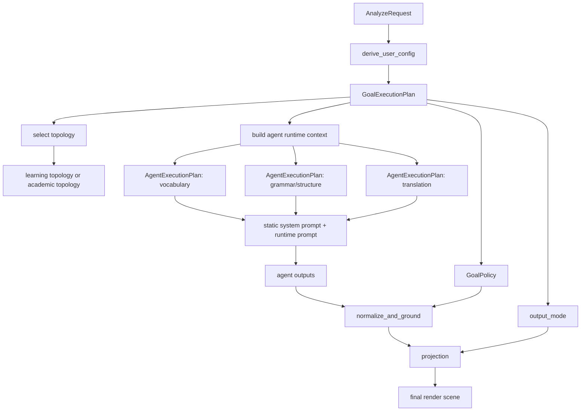

# 差异化输出执行架构设计

> 文档定位：定义 Claread 透读在 Workflow V3 中支持差异化输出的代码级执行架构，重点回答 `reading_goal` / `reading_variant` 会影响哪些阶段、如何装配 prompt、何时需要分叉 agent 拓扑。\
> 生效范围：本稿补充 [Workflow V3 设计与重构文档](./workflow-v3-design.md)，聚焦执行架构，不展开具体 prompt 文案、few-shot 内容库、exam\_tag 数据结构细节。\
> 当前阶段目标：尽快定下可扩展的执行架构，然后优先落地 `daily_reading + intermediate_reading` baseline。\
> 当前明确决策：
>
> - `daily_reading + intermediate_reading` 是唯一 baseline。
> - baseline 定义为“非风格化、只保留基础任务与格式约束”。
> - `exam` 与 `academic` 先完成执行架构设计，不要求本轮立即全部落代码。

## 1. 背景与当前问题

当前代码已经具备差异化输出的基础骨架：

- 请求层可传入 `reading_goal` / `reading_variant`
- `derive_user_rules` 已负责把请求场景映射为内部规则
- 三个主 agent 已拆分为 `vocabulary_agent` / `grammar_agent` / `translation_agent`
- runtime prompt 已支持 section 化组装
- example 注入已预留 `ExampleStrategy`

但现在真正缺的不是“更多 variant 说明”，而是一套清晰的执行架构。

当前主要问题：

1. `profile_id` 同时承担 prompt 语义、实验标识和 normalize 密度控制，职责混杂。
2. 文档之前把配置层拆得过细，但没有给出请求如何流经这些层的端到端数据流。
3. prompt 分层没有区分静态 system prompt 与 runtime prompt，容易把大量稳定约束搬到每次请求里，造成 token 浪费和稳定性下降。
4. `academic` 场景不只是 overlay 差异，而是可能需要 agent 职责和输出协议分支，之前文档没有把这一点提到架构级。

因此本稿只解决下面两个关键问题：

1. 三类 `reading_goal` 在执行时分别影响哪些阶段。
2. 代码层应该如何建模，才能既支持 prompt / few-shot 差异，又支持未来拓扑分支。

## 2. 设计目标

本稿的设计目标只有 4 个：

1. 建立一套足够简单但可扩展的执行配置模型。
2. 明确静态 system prompt 与 runtime 注入内容的边界。
3. 明确 `daily_reading`、`exam`、`academic` 对 workflow 的动态影响范围。
4. 明确哪些差异可以通过 overlay 解决，哪些必须通过拓扑分支解决。

非目标：

1. 当前不定义具体 prompt 正文。
2. 当前不定义具体 few-shot 样例库。
3. 当前不展开 exam\_tag 在数据库中的写法和回填逻辑。
4. 当前不讨论模型选型和 provider 路由。

## 3. 核心结论

### 3.1 差异化输出不只影响 prompt

`reading_goal` 在执行时可能影响 4 类东西：

1. agent 拓扑是否变化
2. 每个 agent 的 system prompt / runtime prompt 是否变化
3. normalize 阶段的硬策略是否变化
4. projection / render contract 是否变化

因此不能把所有差异化都塞进 prompt。

### 3.2 baseline 必须尽量“瘦”

baseline 不是“默认风格”，而是系统的对照组。

它只保留：

- agent 的基础职责
- 输出 schema 约束
- 最基本的任务优先级
- 最少 few-shot

它不应保留：

- 考试导向语气
- 学术导读语气
- 大量示例
- 某一类用户特有的发散解释方式

### 3.3 system prompt 必须静态化，runtime prompt 只放动态信息

在当前实现里，`Agent(..., instructions=...)` 天然承担 system prompt 角色，这一层必须保留。

建议：

- 静态 system prompt：放 agent 长期稳定的角色边界、schema 契约、硬禁止项
- runtime prompt：只放当前请求相关的 goal / variant / policy / few-shot / input\_sentences

这样才能保证：

- 稳定规则不在每次请求重复传输
- agent 类本身仍然是业务逻辑载体
- runtime 注入保持轻量和可替换

### 3.4 `academic` 必须预留拓扑分支

`academic` 的目标不是“学英语”，而是“理解论文/文献内容”。

这意味着它很可能在中期需要：

- 新的 agent 节点
- 新的输出协议
- 新的前端展示方式

所以执行架构必须显式支持 topology branch，而不是默认所有 goal 永远走同一套三 agent 流程。

## 4. 三类 `reading_goal` 对执行链路的影响

下表是本稿最重要的设计结论。

| 阶段                   | `daily_reading`    | `exam`                            | `academic`                      |
| -------------------- | ------------------ | --------------------------------- | ------------------------------- |
| `prepare_input`      | 基本一致               | 基本一致                              | 基本一致，后续可增强术语/引用保留               |
| `derive_user_config` | 生成学习型 plan         | 生成考试型 plan                        | 生成学术理解型 plan                    |
| agent 拓扑             | 使用 learning 拓扑     | 使用 learning 拓扑                    | 短期可兼容 learning，长期需要 academic 拓扑 |
| vocabulary agent     | 普通词汇/短语/语境义支持      | exam\_tag 相关展示与考试优先级              | 术语、学术表达、领域搭配优先                  |
| grammar agent        | 直白解释、少术语           | 随考试类型改变强调点                        | 长期应演化为 structure/argument agent |
| translation agent    | 自然、支持理解            | 兼顾考试理解与句法映射                       | 术语准确、信息结构清晰                     |
| normalize            | 控制密度、去噪            | 控制密度并尊重 exam 优先级                  | 可能要改密度和冲突策略                     |
| projection           | 现有 render contract | 现有 render contract + exam\_tag 展示 | 中长期可能需要新 contract               |

结论拆解如下。

### 4.1 `daily_reading`

&#x20;

本场景是 **meaning-focused**（以理解内容为目标，语言知识是副产品）。

核心原则：语境义优先于生词标注。用户的主要障碍不是纯生词，而是"认识但在这里不确定什么意思"的多义词和短语搭配。

它影响：

- vocabulary 选点偏向高价值词、短语、语境义（语境义 > 生词）
- grammar 解释偏向"怎么理解"，弱化术语堆叠
- translation 偏向自然、顺畅、帮助理解
- normalize 密度控制偏克制

它不影响：

- 主 workflow 拓扑
- 对外 render scene 基本协议

所以 `daily_reading` 主要是 prompt 与 normalize policy 的差异，不需要拓扑分支。

### 4.2 `exam`

&#x20;

本场景是 **form-focused**（以识别和运用语言形式为目标，内容理解是手段）。

与 `daily_reading` 的本质区别不是"程度"，而是"解析目标"：

- vocabulary 不只是调优先级，而是从"帮你理解这个词"转向"帮你掌握这个词的考试相关用法"（词义辨析、固定搭配、常考语境）
- grammar 不只是调强调程度，而是从"帮你读懂这句"转向"帮你看到考试在考什么"

它影响：

- vocabulary 的选点逻辑和解释角度
- grammar / sentence analysis 的解析目标
- translation 的表达重心
- 前端单词卡片是否显示 exam\_tag

它当前不必影响：

- 主 workflow 拓扑
- 主 render scene 协议

所以 `exam` 第一阶段仍属于“共享拓扑 + 独立策略包”。

### 4.3 `academic`

&#x20;

本场景是"学术文本理解"，用户主要不是来学英语，而是来理解内容。

学术文本的理解障碍主要来自信息密度和论证结构，而不是语法难度本身。典型障碍包括：衔接信号词的论证关系、高密度指代链条、名词化与被动语态导致的信息压缩。这些都不属于传统 grammar 或 vocabulary 的范畴，这也是 `grammar_agent` 长期应演化为 `structure_agent` 的语言学依据。

它影响：

- 词汇解释目标从"英语学习"转向"术语理解"
- 语法讲解目标从"语法学习"转向"结构与论证理解"
- 翻译目标从"自然易懂"转向"术语准确、关系清晰"

它中期可能影响：

- agent 名称与职责
- normalize 策略
- projection 输出
- 前端页面布局

所以 `academic` 必须被视为潜在的 topology branch，而不是单纯 overlay。

## 5. 推荐的配置模型

之前文档把配置拆成 5 层，过细了。本稿改为只保留 3 个核心对象。

## 5.1 `AnalyzeRequest`

对应用户原始输入。

职责：

- 表达用户选择了什么目标和变体
- 不包含派生策略

建议继续保留：

- `reading_goal`
- `reading_variant`
- `source_type`

## 5.2 `GoalExecutionPlan`

这是整个差异化执行架构的核心对象。

职责：

- 表达“这个请求实际应该怎么跑”

建议包含：

```python
GoalExecutionPlan(
    goal_id: str,
    variant_id: str,
    topology_mode: Literal["learning", "academic"],
    output_mode: Literal["learning_scene_v1", "academic_scene_v1"],
    prompt_profile: str,
    few_shot_mode: Literal["baseline", "manual", "rag"],
    policy: GoalPolicy,
    agent_plans: dict[str, AgentExecutionPlan],
)
```

说明：

- `topology_mode` 决定走哪套 workflow/agent 拓扑
- `output_mode` 决定 projection 目标协议
- `policy` 是硬策略，normalize 必须依赖它
- `agent_plans` 是每个 agent 的运行时配置

## 5.3 `AgentExecutionPlan`

职责：

- 表达某个 agent 在当前请求下如何运行

建议包含：

```python
AgentExecutionPlan(
    enabled: bool,
    system_prompt_id: str,
    runtime_prompt_sections: list[PromptSection],
    few_shot_examples: list[ExampleEntry],
    soft_hints: dict[str, object],
)
```

关键点：

- `system_prompt_id` 指向静态 prompt 模板，不把长 system prompt 塞到 runtime
- `runtime_prompt_sections` 只放当前请求相关信息
- `few_shot_examples` 是当前请求最终决议后的样例，而不是 provider 本身

## 5.4 `GoalPolicy`

职责：

- 表达所有确定性硬策略

建议包含：

```python
GoalPolicy(
    annotation_density: int,
    vocabulary_focus: str,
    grammar_focus: str,
    translation_focus: str,
    terminology_mode: str,
    expansion_mode: str,
    normalize_priority: dict[str, int],
)
```

这层由代码消费，不直接作为 prompt 文本。

## 6. 端到端数据流

这是差异化输出开发时最重要的数据流图。



执行顺序解释：

1. API 收到 `AnalyzeRequest`
2. `derive_user_config` 不再只生成 `UserRules`，而是生成 `GoalExecutionPlan`
3. workflow 根据 `topology_mode` 决定运行哪套 agent 拓扑
4. 每个 agent 读取自己的 `AgentExecutionPlan`
5. agent 运行时使用：
   - 静态 `instructions` 作为 system prompt
   - `runtime_prompt_sections` + `few_shot_examples` + `input_sentences` 作为 runtime prompt
6. `normalize_and_ground` 读取 `GoalPolicy` 执行硬限制
7. `projection` 根据 `output_mode` 生成对应的 render contract

## 7. system prompt 与 runtime prompt 的边界

这是本稿必须定死的一条规则。

## 7.1 静态 system prompt 中必须保留的内容

静态 system prompt 属于 agent 定义的一部分。

建议长期保留：

- agent 的角色定义
- agent 负责哪些输出类型
- schema 合法性约束
- 锚点必须来自原句
- 不允许输出 schema 外内容
- 不确定时如何保守处理

这类内容是稳定的、跨请求复用的，不应在每次 runtime 注入。

## 7.2 runtime prompt 中允许变化的内容

runtime prompt 只放当前请求才会变化的部分：

- `reading_goal`
- `reading_variant`
- 本次 `GoalPolicy` 翻译出来的场景约束
- few-shot
- 当前输入句子

推荐 runtime section 只有 4 类：

1. `request_context`
2. `scenario_policy`
3. `examples`
4. `input_sentences`

不再建议继续拆成大量抽象层。

## 7.3 为什么不能把所有逻辑都移到 runtime

如果几乎所有说明都放入 runtime：

- 每次请求都要重复发送长文本
- system prompt 的稳定锚点会被削弱
- agent 类会退化成空壳
- 不利于长期维护和 code review

因此本稿的明确决策是：

- agent 类继续保留静态业务身份
- runtime 层只负责请求相关差异

## 8. 拓扑分支设计

## 8.1 `learning` 拓扑

适用于：

- `daily_reading`
- `exam`

建议节点：

- `vocabulary_agent`
- `grammar_agent`
- `translation_agent`
- `normalize_and_ground`
- `project_render_scene`

## 8.2 `academic` 拓扑

适用于：

- `academic`

短期兼容方案：

- 仍可复用 `vocabulary_agent`
- 仍可临时复用 `translation_agent`
- `grammar_agent` 先通过 prompt 退化为结构解释器

中期目标：

- 将 `grammar_agent` 替换为 `structure_agent`
- 明确其职责是：
  - 句法层次拆解
  - 论证/信息结构提示
  - 学术句子压缩结构展开

长期风险：

- `academic` 可能需要不同的 projection 与前端页面结构

因此执行架构必须允许：

- `topology_mode = academic`
- `output_mode != learning_scene_v1`

即使这一轮不立刻实现，也必须在设计中留出口。

## 9. normalize 策略的优先级

`annotation_density` 的归属必须明确。

本稿结论：

- `annotation_density` 属于 `GoalPolicy`
- 真正执行位置在 `normalize_and_ground`
- prompt 中关于密度的描述只是 soft hint

优先级顺序必须写死为：

1. schema 合法性
2. `GoalPolicy` 硬策略
3. prompt soft hint
4. 模型自由发挥

也就是说：

- prompt 可以鼓励“少标”或“均衡”
- 但最终保留多少条，必须由 normalize 的硬策略裁定

这样才能避免：

- prompt 说少标，normalize 又放宽
- prompt 想多标，normalize 又无上限

两边互相打架。

## 10. `exam` 变体命名的正式说明

本稿采用以下 `reading_variant` 设计：

- `gaokao`
- `cet`
- `gre_tem`
- `ielts_toefl`

说明如下。

### 10.1 `gaokao`

- 面向高考
- 对应 `exam_tag = [gaokao]`

### 10.2 `cet`

- 面向大学英语四六级
- 对应 `exam_tag = [cet4, cet6]`

### 10.3 `gre_tem`

这里的 `gre_tem` 不是指美国 GRE 考试。

它表示一个合并场景：

- 考研英语
- TEM（中国英语专业等级考试）

对应 `exam_tag = [gre, tem4, tem8]`

其中：

- 数据库内部仍使用 `gre` 作为考研英语的 legacy tag
- 前端展示文本统一渲染为“考研”

这个命名的含义必须在代码注释和文档中明确，否则极易误解为真正的 GRE。

### 10.4 `ielts_toefl`

- 面向雅思 / 托福
- 对应 `exam_tag = [ielts, toefl]`

## 11. exam\_tag 的职责边界

本轮已知事实：

- exam\_tag 已插入 PostgreSQL 词典数据库
- exam\_tag 当前不参与筛选
- exam\_tag 当前不建索引
- exam\_tag 当前只用于当用户选择对应 exam variant 时，在单词卡片上显示该词相关考试标签

因此本稿明确：

- exam\_tag 当前是“展示增强信号”
- 不是 retrieval filter
- 不是 candidate selection 的硬条件

后续如果要把 exam\_tag 纳入词汇优先级计算，应单独设计，不在本稿默认开启。

## 12. 推荐代码改造方向

推荐逐步把现有实现收敛为下列职责：

- `derive_user_rules` 升级为 `build_goal_execution_plan`
- `PromptStrategy` 升级为 `AgentExecutionPlan.runtime_prompt_sections`
- `ExampleStrategy` 升级为最终 resolved examples
- `normalize_and_ground` 不再依赖 `profile_id`，改依赖 `GoalPolicy`

建议新增或演化的文件职责：

- `app/services/analysis/goal_execution_plan.py`
  - 定义 `GoalExecutionPlan`、`AgentExecutionPlan`、`GoalPolicy`
- `app/services/analysis/goal_planner.py`
  - 负责 `AnalyzeRequest -> GoalExecutionPlan`
- `app/services/analysis/runtime_prompt_builder.py`
  - 负责从 `AgentExecutionPlan` 生成 runtime prompt sections
- `app/services/analysis/topology_selector.py`
  - 负责根据 `topology_mode` 选择 learning / academic 拓扑

现有文件的迁移方向：

- `user_rules.py`
  - 保留兼容层，逐步退出主路径
- `prompt_strategy.py`
  - 收缩为 runtime prompt 组装工具
- `example_strategy.py`
  - 收缩为 example resolve 工具
- `strategy_builder.py`
  - 被 `goal_planner.py` 吸收

## 13. 第一阶段落地范围

当前最优先、也最务实的落地范围如下：

1. 先不改 workflow 拓扑。
2. 先引入 `GoalExecutionPlan` / `AgentExecutionPlan` / `GoalPolicy` 三个对象。
3. 先把静态 system prompt 与 runtime prompt 边界切清。
4. 先把 `normalize_and_ground` 对密度的依赖改成读取 `GoalPolicy`。
5. 先只落地 `daily_reading + intermediate_reading` baseline。

这一阶段暂不做：

1. `academic` 新节点
2. 新 projection contract
3. `exam` 复杂优先级逻辑
4. RAG few-shot

## 14. 后续讨论顺序

建议后续按这个顺序推进：

1. 先定 `GoalExecutionPlan` / `AgentExecutionPlan` / `GoalPolicy` 的字段。
2. 再定三个 agent 的静态 system prompt 与 runtime prompt 边界。
3. 再收敛 `daily_reading + intermediate_reading` baseline prompt。
4. 再讨论 `daily_reading` 其他 variant 的策略差异。
5. 再讨论 `exam` 的 prompt / example / exam\_tag 展示增强。
6. 最后单独开一轮讨论 `academic` 拓扑和前端协议。

## 15. 最终结论

差异化输出策略真正要解决的不是“每个 variant 用什么语气”，而是下面这套执行问题：

1. 请求进入后，系统如何决定当前该走哪套拓扑。
2. 每个 agent 的哪些约束应静态固化，哪些应动态注入。
3. normalize 的硬策略从哪里来，谁说了算。
4. 哪些 `reading_goal` 只是策略差异，哪些已经是任务定义差异。

本稿的明确答案是：

- `daily_reading` 和 `exam` 先共享 learning 拓扑
- `academic` 预留 topology branch
- system prompt 静态化，runtime prompt 只保留请求相关差异
- 用 `GoalExecutionPlan` 统一承载所有运行时差异
- 用 `GoalPolicy` 统一承载 normalize 的硬策略

这样后续再推进具体 variant 风格时，系统不会再次退化成一个难以维护的大 prompt 分支集合。
