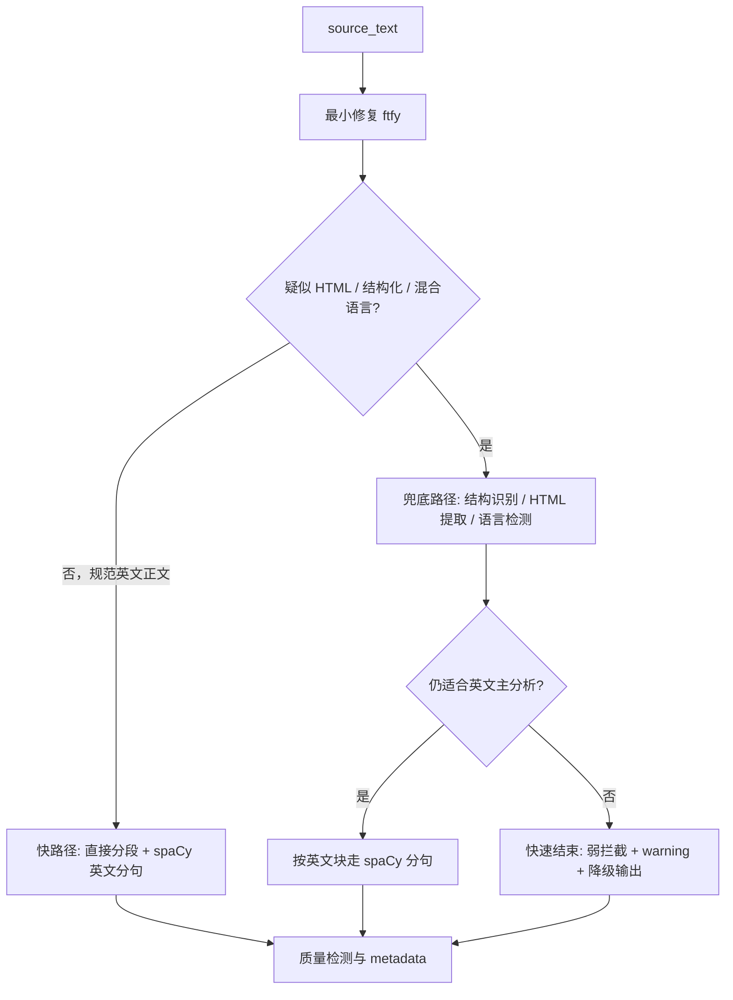

# `prepare_input` 预处理重构设计文档

> 文档定位：用于指导 `server/app/services/analysis/input_preparation.py` 的输入清洗、语言检测、分块、分句与快速退出机制重构。  
> 生效范围：本稿只覆盖 `prepare_input` 与其直接依赖，不展开下游 agent prompt、projection 或前端渲染协议改造。  
> 核心目标：在不牺牲主链路性能的前提下，让输入预处理对缩写、混合语言、结构化文本和轻度脏文本更稳健。

## 1. 背景

当前 `prepare_input` 的主要职责是：

- 轻量清洗输入文本
- 划分 paragraph
- 进行 sentence split
- 计算 `english_ratio` / `noise_ratio` / `text_type`
- 生成稳定的 `paragraph_id` / `sentence_id` / `sentence_span`

现状问题集中在两类：

1. 基础语言处理过度依赖正则。
2. 产品质量规则和语言学处理规则耦合在同一层。

已暴露的直接问题包括：

- `The U.S. Centers ...` 被错误断成两句
- HTML、Markdown、链接、代码片段清洗依赖多条正则，边界脆弱
- 混合语言、结构化说明文档、参数表一类输入会被误当作自然文章处理

这些问题说明：

- “句子边界识别”不应继续主要依赖手写 regex
- “文本修复”和“产品 warning 判定”需要拆层
- `prepare_input` 必须有快速结束逻辑，不能把所有输入都按最重路线完整跑一遍

## 2. 设计目标

本次重构目标按优先级排序如下：

1. 对规范英文正文维持快速、稳定、低延迟处理。
2. 为缩写、引号、括号、省略号等常见英语边界提供稳健句切分。
3. 对混合语言、结构化文本、疑似 HTML 文本提供兜底分支，而不是继续误切分。
4. 保持 `sentence_span.start` / `end` 可稳定映射回 `render_text`。
5. 把库依赖控制在合理范围，避免引入难维护的大而全栈。

## 3. 非目标

本次重构明确不做以下事情：

- 不在 `prepare_input` 中引入全文 LLM 改写或自动润色
- 不让前端 CloudBase AI 成为 canonical preprocessing 的一部分
- 不在本阶段引入全文语法解析、POS、lemma 等重 NLP 能力到主链路
- 不对所有非英文文本提供完整教学分析能力
- 不把结构化文档强行转换为“自然文章”

## 4. 总体思路

新方案采用“快路径优先，重路径兜底”的分层设计。

关键原则：

- 默认用户输入是“规范英文文本”，优先走快路径
- 只有检测到明显异常形态时才进入兜底路径
- 兜底路径的目标是“避免错误处理”，不是“强行把所有输入都分析好”

## 5. 推荐处理链路

### 5.1 层级拆分

推荐将 `prepare_input` 拆成以下逻辑层：

1. `source_text` 保留层
2. 最小文本修复层
3. 结构识别层
4. 文档类型与语言判定层
5. 分段与分句层
6. 质量检测层

### 5.2 具体流程

#### 第一步：保留原文

- `source_text` 永远原样保存
- 后续任何修复、抽取、规整都只作用于 `render_text`

原因：

- 便于追溯
- 便于 debug
- 避免下游误以为系统改写了用户文本

#### 第二步：最小文本修复

目标：

- 修复编码、乱码、HTML 实体、异常 Unicode
- 不改变文本语义
- 尽量不改动字符序列的教学意义

推荐：

- `ftfy.fix_text()`

不推荐默认使用：

- `clean-text`

原因：

- `clean-text` 面向通用脏文本清洗，常见用法会附带更多归一化与替换
- 对教学场景和 offset 稳定性来说，过清洗风险偏高

#### 第三步：结构识别

目标：

- 尽早区分自然正文、HTML、结构化说明文档、代码样式文本
- 避免所有输入都进入同一种分句逻辑

推荐：

- 先做轻量启发式判断
- 如疑似 HTML，再走 `BeautifulSoup`
- 结构化文本和代码样式文本可直接弱拦截，不必强行深入处理

#### 第四步：语言检测

目标：

- 识别主语言
- 辅助区分 `article` / `mixed_text` / `structured_doc`
- 决定是否继续走英文主分析链路

推荐：

- 文档级语言检测 + `english_ratio` 联合判断
- 语言检测结果只作为辅助信号，不单独一票否决

#### 第五步：分段与分句

目标：

- 对英文正文稳定输出 `paragraphs` / `sentences`
- 保留 `start_char` / `end_char` 精确映射

推荐：

- paragraph 仍以空行和结构分块为主
- sentence split 使用 `spaCy en_core_web_sm`
- 使用 `Span.start_char` / `end_char` 生成 `sentence_span`

#### 第六步：质量检测

目标：

- 给下游提供 warning，而不是做过重拦截

可保留的自定义规则：

- `english_ratio`
- `noise_ratio`
- 字数下限
- 句数异常
- 平均句长异常
- `text_type`

## 6. 快速退出机制

这是本次设计的硬约束。

`prepare_input` 必须首先服务规范英文正文，不得把每次输入都送入最重流程。推荐按以下顺序快速结束：

### 6.1 快路径命中条件

满足以下多数条件时，直接走快路径：

- 文本长度在合理范围内
- HTML 特征弱
- 结构化字段特征弱
- 英文字符占比高
- 换行分布接近自然正文
- 非代码样式

快路径行为：

- `ftfy`
- 简单 paragraph split
- `spaCy en_core_web_sm` 分句
- 质量检测

### 6.2 兜底路径触发条件

仅在以下场景进入兜底路径：

- 疑似 HTML
- 中英混排占比明显
- 参数表 / API 文档 / 字段说明文档特征明显
- 代码块 / JSON / 配置文本特征明显
- 分句结果明显异常

### 6.3 快速结束场景

以下场景不应继续深处理：

- 主语言不是英文，且英文片段很少
- 结构化文本占主体，不具备自然阅读分析价值
- 文本太短，无法形成稳定句子
- 噪声比过高

快速结束的输出要求：

- 保留 `render_text`
- 尽量保留 paragraph
- sentence 可为空或仅保守切分
- 产出 warning
- 不抛异常、不整包失败

### 6.4 设计原则

- 快速退出不是报错
- 快速退出是“避免错误进入主分析链路”
- 快速退出后的结果要让前端能稳定降级展示

## 7. 库与依赖选型

### 7.1 文本修复

#### 推荐：`ftfy`

用途：

- 修复 Unicode 异常、乱码、HTML entity

优点：

- 目标明确
- 改动相对克制
- 适合作为最小修复层

风险：

- 仍需控制具体配置，避免不必要的字符替换

来源：

- [ftfy docs](https://ftfy.readthedocs.io/en/latest/config.html)

#### 备选：`clean-text`

用途：

- 通用脏文本清洗

优点：

- 集成度高
- 已内置若干修复与归一化能力

缺点：

- 更容易过清洗
- 默认行为不够适合作为教学文本的 canonical preprocessing

结论：

- 不作为主链路默认依赖
- 如后续需要处理更脏的抓取文本，可在专门路由中评估

来源：

- [clean-text PyPI](https://pypi.org/project/clean-text/)

### 7.2 HTML 处理

#### 推荐：`BeautifulSoup`

用途：

- HTML 转纯文本

优点：

- 现有项目已依赖
- 比正则剥标签稳健
- 可通过 `get_text(separator="\n")` 保留结构感

风险：

- 只适合“HTML 转文本”，不负责网页主内容抽取

来源：

- [BeautifulSoup `get_text()`](https://www.crummy.com/software/BeautifulSoup/bs4/doc/#get-text)

#### 备选：`trafilatura`

用途：

- 网页正文提取

优点：

- 适合整页网页、博客、新闻正文抽取
- 对 header/footer/nav 噪声比 BeautifulSoup 更稳

缺点：

- 对普通用户粘贴文本不是刚需
- 新增依赖和处理成本更高

结论：

- 不作为当前 `prepare_input` 默认依赖
- 如未来输入源扩展到 URL/网页抓取，再单独引入

来源：

- [Trafilatura docs](https://trafilatura.readthedocs.io/en/stable/)

### 7.3 语言检测

#### 推荐：`lingua-language-detector`

用途：

- 文档级主语言检测

优点：

- 质量优先
- 对中英区分更可靠

缺点：

- 体积较大
- 对部署和冷启动更重

结论：

- 推荐作为质量优先方案
- 需评估 wheel 体积和实际部署成本

来源：

- [lingua-language-detector PyPI](https://pypi.org/project/lingua-language-detector/)

#### 备选：`langdetect`

用途：

- 轻量语言检测

优点：

- 依赖轻
- 接入简单

缺点：

- 对短文本和混合文本更不稳定
- 工程维护活跃度和现代化程度一般

结论：

- 可作轻量备选
- 不建议在混合语言场景完全依赖其结果

来源：

- [langdetect PyPI](https://pypi.org/project/langdetect/)

### 7.4 分句

#### 推荐：`spaCy + en_core_web_sm`

用途：

- 英文 sentence segmentation
- 输出稳定 `start_char` / `end_char`

优点：

- 直接提供句子边界 span
- 后续若要扩展 token / lemma / POS，也可继续复用
- 比手写 regex 稳健得多

缺点：

- 需要额外安装英文模型
- 比纯规则库更重

结论：

- 作为本次重构的推荐方案

来源：

- [spaCy sentence segmentation](https://spacy.io/usage/linguistic-features#section-sbd)
- [spaCy Sentencizer API](https://spacy.io/api/sentencizer/)

#### 备选：`pySBD`

用途：

- 句子边界识别

优点：

- 专注 sentence boundary disambiguation
- 接入简单
- 比手写 regex 明显更强

缺点：

- 不直接提供完整 spaCy 那样的后续 NLP 扩展路径
- offset 和下游统一栈能力不如 spaCy

结论：

- 是有效备选
- 如果后续只想解决分句，不做更广的英语处理，也可考虑切换到它

来源：

- [pySBD repository](https://github.com/nipunsadvilkar/pySBD)

#### 备选：`NLTK Punkt`

用途：

- 基于缩写与上下文学习的 sentence tokenizer

优点：

- 明显强于简单正则
- 有成熟理论基础

缺点：

- 官方说明预训练模型未必适合具体目标域
- 更像通用 NLP 工具，不是当前工程上的最佳优先选项

结论：

- 不作为当前首选

来源：

- [NLTK Punkt docs](https://www.nltk.org/_modules/nltk/tokenize/punkt)

#### 备选：`BlingFire`

用途：

- 高性能 sentence breaking

优点：

- 速度很快

缺点：

- 工程可解释性和可调试性弱于 spaCy
- 当前收益主要在极致性能，不是当前第一痛点

结论：

- 仅在后续性能成为瓶颈时再评估

来源：

- [BlingFire repository](https://github.com/microsoft/BlingFire)

## 8. 推荐依赖组合

当前阶段推荐组合如下：

- `ftfy`
- `beautifulsoup4`（已存在）
- `spaCy`
- `en_core_web_sm`

语言检测建议分两档：

- 质量优先：`lingua-language-detector`
- 体积优先：`langdetect`

不进入当前主链路的依赖：

- `clean-text`
- `trafilatura`
- CloudBase AI / Agent

## 9. 输入类型判定建议

推荐把 `text_type` 从当前的粗粒度：

- `article`
- `list`
- `code`
- `other`

扩展为更贴近处理策略的内部分类：

- `article_en`
- `article_mixed`
- `structured_doc`
- `html_like`
- `code_like`
- `other`

对外是否暴露新枚举可后续再决定，但内部判定应先细化。

## 10. 极端输入处理策略

### 10.1 中英混排说明文

示例特征：

- 中文为主
- 局部包含一整句英文
- 语篇主体不是英语阅读材料

推荐处理：

- 判定为 `article_mixed`
- 不作为完整英文正文进入主分析链路
- 若后续有收益，可只提取连续英文块做局部分析
- 当前阶段至少应给出 warning，而不是误当英文文章整包分句

### 10.2 API / 参数说明文档

示例特征：

- 字段名、类型、解释交替出现
- 换行密集
- 非自然语篇

推荐处理：

- 判定为 `structured_doc`
- 不强行走自然句子切分
- 以 block 为主保守保留
- 给出 warning，提示结果可能降级

## 11. 为什么不把 LLM 清理放进主链路

CloudBase AI 或其他 LLM 清理能力可以作为辅助功能，但不应成为 canonical preprocessing。

原因：

- LLM 可能改写文本，破坏字符级对齐
- `sentence_span`、grounding、substring 校验都依赖字面稳定性
- 每次输入前先走一轮模型会显著增加延迟与成本
- 对规范英文主路径来说，收益低于代价

更合理的定位：

- 显式“智能清洗文本”功能
- 用户可见 diff
- 用户确认后再提交分析

相关资料：

- [CloudBase Mini Program AI quickstart](https://docs.cloudbase.net/en/ai/quickstart/miniprogram)
- [CloudBase Web AI docs](https://docs.cloudbase.net/en/ai/model/web-access)

## 12. 实施建议

推荐按以下顺序落地：

1. 引入 `ftfy`
2. 保留 `BeautifulSoup`，移除大部分 HTML 正则清洗逻辑
3. 引入 `spaCy` 和 `en_core_web_sm`
4. 在 `prepare_input` 中实现“快路径 + 兜底路径 + 快速结束”
5. 再评估是否需要引入语言检测库

原因：

- 当前最痛的 bug 是 sentence split
- `spaCy` 能直接解决缩写与字符 offset 需求
- 语言检测属于辅助判断，不必阻塞主重构

## 13. 测试与回归要求

需要新增 preprocess regression cases，至少覆盖：

- `U.S.` / `U.K.` / `Ph.D.` / `e.g.`
- 引号、括号、省略号
- HTML 片段
- Markdown 链接与代码块
- 中英混排长文
- API/字段说明文档
- 极短文本
- 高噪声复制内容

验收标准：

- 规范英文正文仍走快路径
- 断句正确率明显优于当前 regex
- `sentence_span` 能稳定映射回 `render_text`
- 异常类型输入不会误进入重分析主链路
- 快速退出后前端仍可稳定降级展示

## 14. 最终建议

本次重构的推荐落点是：

- 文本修复：`ftfy`
- HTML 处理：`BeautifulSoup`
- 分句：`spaCy + en_core_web_sm`
- 质量检测：保留自定义规则
- 快速退出：作为强约束写入实现

这意味着 `prepare_input` 的职责将从“正则拼装器”升级为：

- 一个优先服务规范英文正文的轻量预处理器
- 一个对异常输入具备保守兜底能力的入口路由

而不是：

- 一个试图用越来越多 regex 覆盖所有文本形态的规则堆栈
