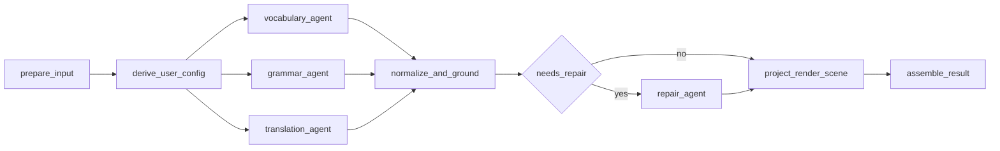

# Workflow V3 设计与重构文档

> 文档定位：用于指导 Claread透读 下一阶段 workflow 重构、前后端联调与质量收敛。  
> 生效范围：本稿是 v3 重构阶段的唯一设计参考；当前线上/本地实现若仍为 v2.1，以代码现状为准，但后续改造与联调以本稿为准。  
> 核心目标：把“LLM 的语义理解能力”和“前端渲染协议的确定性”彻底拆开。

## 1. 背景与问题

当前 v2.1 的总体方向是对的：

- 不再让 LLM 直接生成前端页面协议。
- 先产出语义层 annotation，再由后端做 projection。
- 用 substring anchor 替代脆弱的 span 坐标。

但当前实现仍存在一个决定性问题：

- 主流程只有一个核心 LLM node，同时负责词汇标注、语法分析、长难句讲解、逐句翻译、结构化输出。

这会导致三类问题互相干扰：

1. 语义理解和格式约束互相抢注意力。
2. 词汇类输出容易吃掉语法类输出的上下文预算。
3. 单点失败会放大成整包失败，前端无法稳定联调。

对 Claread 来说，核心价值不是“像 chatbox 一样会分析”，而是：

- 用户输入任意英文文本后，
- 后端稳定产出正确、可解析、可渲染的数据，
- 前端把它渲染成结构清晰、可交互的解读页面。

因此 v3 的主设计原则不是“尽量让一个 agent 全做完”，而是：

- LLM 负责理解、选点、解释与翻译。
- 代码负责合并、校验、裁剪、修复与投影。

## 2. 设计目标

v3 的目标按优先级排序如下：

1. 输出正确。
2. 输出能被后端稳定处理。
3. 输出能被前端稳定渲染。
4. 在正确性的前提下，逐步增强解释深度。

这里的“正确”同时包括两层：

- 语言学正确：词义、语法、句解、翻译本身正确。
- 工程正确：schema 合法、锚点可落地、前端可解析、链路可观测。

## 3. 非目标

v3 第一版不追求以下能力：

- 不处理高噪音文本的专门路由；后续可在 `prepare_input` 后增加 router。
- 不把全文 summary 暴露给前端正式协议；可内部保留。
- 不引入 RAG dynamic few-shot 到主链路；先把基础 workflow 做稳。
- 不为了回归集 `must_hit` 去逼模型命中特定文本片段。

## 4. 总体架构

v3 的主图如下：

一句话概括：

- 前段是并行语义生成。
- 中段是确定性稳定化。
- 后段是可选修复和前端协议投影。

## 5. 节点设计

### 5.1 `prepare_input`

职责：

- 轻量清洗输入文本。
- 划分 paragraph。
- 进行 sentence split。
- 生成稳定的 `paragraph_id` / `sentence_id`。
- 产出后续 grounding 使用的 canonical text 基准。

v3 第一版保留轻量处理，不做高噪音专门治理。

约束：

- 不做过重的业务判断。
- `text_type` / `english_ratio` 改为弱拦截，不轻易整包拒绝。
- 这里的产物必须足够稳定，供后续所有 agent 共享。

### 5.2 `derive_user_config`

职责：

- 接收请求里的阅读目标与阅读模式。
- 产出标准化的 `user_config`、`prompt_strategy`、`example_strategy`。
- 为所有 agent 提供同一套配置来源。

v3 基线配置：

- `reading_goal = daily_reading`
- `reading_variant = intermediate_reading`

这个基线配置视为“0 档”：

- 不额外叠加复杂提示。
- 不额外叠加大量 few-shot。
- 先保证标准输出质量。

后续扩展原则：

- prompt 注入、few-shot 注入、RAG 注入都走策略层，不写死在 node 内。
- baseline 可以是空 examples 或极少 examples。
- 任何新配置都不能破坏 baseline 的稳定性。

### 5.3 `vocabulary_agent`

职责：

- 专注词汇维度标注。
- 负责产出：
  - `vocab_highlight`
  - `phrase_gloss`
  - `context_gloss`

输入：

- `source_text`
- `paragraphs`
- `sentences`
- `user_config`
- `prompt_strategy`
- `example_strategy`

输出：

- `vocabulary_draft`

设计要求：

- 不负责语法说明。
- 不负责长难句拆解。
- 不负责逐句翻译。
- 允许漏标，不允许大面积低价值误标。

### 5.4 `grammar_agent`

职责：

- 专注结构维度标注。
- 负责产出：
  - `grammar_note`
  - `sentence_analysis`

输入与 `vocabulary_agent` 一致。

输出：

- `grammar_draft`

设计要求：

- 不负责词汇考试标签。
- 不负责词典查词语义。
- 不负责逐句翻译。
- 要优先覆盖显著复杂句，而不是追求数量。

关于 `sentence_analysis.chunks`：

- v3 降级为可选增强字段。
- `sentence_analysis` 主链路成功条件不再依赖 `chunks`。
- 如模型产出高质量 chunks，则保留；否则不作为失败原因。

### 5.5 `translation_agent`

职责：

- 独立完成逐句翻译。
- 可内部补充 `article_summary`，但不进入 v3 正式前端协议。

输出：

- `translation_draft`

设计要求：

- 逐句翻译完整优先于风格花哨。
- 翻译链路与 annotation 链路解耦，避免互相抢 token budget。
- translation 缺失应有明确 warning，不允许静默吞掉。

### 5.6 `normalize_and_ground`

这是 v3 最关键的稳定化节点。

它不是简单 validator，而是“候选结果收敛层”。

职责：

- 合并 `vocabulary_draft`、`grammar_draft`、`translation_draft`
- 做 substring grounding
- 校验 `sentence_id`
- 处理 `occurrence`
- 去重
- 同句密度控制
- 低价值标注裁剪
- 类型冲突消解
- 缺失字段清理
- 生成删除/降级日志

这里允许删除 annotation，但必须记录日志。

删除日志至少记录：

- `source_agent`
- `annotation_type`
- `sentence_id`
- `anchor_text`
- `drop_reason`
- `drop_stage`

推荐冲突优先级：

- `context_gloss` > `phrase_gloss` > `vocab_highlight`
- `grammar_note` 与词汇类不互斥
- `sentence_analysis` 独立存在

推荐裁剪原则：

- 同句优先保留高教学价值标注。
- 简单高频词不进入 `vocab_highlight`。
- 锚点不合法的标注直接删除，不进入前端契约。

### 5.7 `repair_agent`

只在失败时触发。

触发条件建议：

- parse 失败
- grounding 失败率超过阈值
- 关键组件整类缺失且文本明显需要该组件
- 输出可恢复，但不适合直接投影

`repair_agent` 的权限边界：

- 可以修复 `sentence_id`
- 可以修复 `anchor_text`
- 可以补齐缺失字段
- 可以修正枚举值与结构格式
- 可以删除无效项

但它不能：

- 凭空新增新的语义标注点
- 改写原有标注意图
- 重做全文分析

换句话说，`repair_agent` 是 repair，不是第二个 annotation agent。

### 5.8 `project_render_scene`

职责：

- 把内部标准化结果 deterministic 地投影为前端渲染协议。

这一步继续由代码完成，不交给 LLM。

原因：

- render contract 是前端最硬的边界。
- 越靠近前端协议，越不能依赖概率生成。
- v2 的经验已经证明，让模型直接承担 render 协议生成不稳。

### 5.9 `assemble_result`

职责：

- 收敛最终响应对象。
- 挂载 request metadata。
- 带出 warning、drop log 摘要和联调需要的调试信息。

## 6. 内部数据分层

v3 建议明确区分四层对象：

1. `preprocess_result`
2. `*_draft`
3. `normalized_result`
4. `render_scene`

建议 state key：

- `source_text`
- `preprocess_result`
- `user_config`
- `prompt_strategy`
- `example_strategy`
- `vocabulary_draft`
- `grammar_draft`
- `translation_draft`
- `normalized_result`
- `drop_log`
- `repair_request`
- `render_scene`
- `processing_warnings`

建议 schema 分层：

- `VocabularyDraft`
- `GrammarDraft`
- `TranslationDraft`
- `NormalizedAnnotationResult`
- `RenderSceneModel`

原则：

- agent 输出 draft。
- 只有 `normalize_and_ground` 之后的对象才有资格进入 projection。

## 7. 前端联调与协议约束

### 7.1 前端当前能接住的主结构

当前结果页主渲染能力已经能覆盖以下数据：

- `article`
- `translations`
- `inline_marks`
- `sentence_entries`
- `warnings`

这意味着 v3 第一版不需要扩展前端交互范式，只需要让后端稳定提供这套结构。

### 7.2 summary 不进入 v3 正式前端协议

`translation_agent` 可以内部生成 summary，但 v3 第一版不暴露给前端。

原因：

- 当前结果页没有稳定的 summary 展示位。
- 先把标注页面联调打稳，比增加新展示块更重要。

### 7.3 richer markdown 继续保留

前端当前 markdown 解析能力已支持：

- header
- quote
- list
- inline code
- bold / italic

因此 v3 文档口径放宽：

- 允许 richer markdown
- 但不引入更复杂的块级富文本协议

### 7.4 前后端接口一致性

v3 必须打通真实联调，不再只依赖 mock。

协议原则：

- 后端对外 contract 只有一份。
- 不保留并行旧协议。
- 命名保持统一，不再继续扩散 `v2` 风格命名。

推荐做法：

- API 正式 contract 继续使用 `snake_case`
- 前端如果保留 view-model，可在单一 adapter 层转换
- adapter 必须集中，不允许页面和组件各自做字段转换

### 7.5 前端重命名清理

为避免版本号继续污染命名，v3 重构时建议同步清理前端命名：

- `client/src/types/v2-render.ts` -> `client/src/types/render-scene.ts`
- `client/src/pages/result-v2/` -> `client/src/pages/result/`

同时：

- mock 数据入口同步去版本化
- 页面路由、组件引用、类型引用全部更新

## 8. 用户配置架构

用户配置在 v3 中不是“先不用”，而是“先做架构，再只启用 baseline”。

建议拆分为三层：

1. `request_config`
2. `derived_user_config`
3. `strategy_bundle`

其中：

- `request_config` 对应用户请求里的原始字段
- `derived_user_config` 对应标准化阅读配置
- `strategy_bundle` 对应 prompt / few-shot / future RAG 的注入策略

建议能力边界：

- node 不直接拼凑零散 prompt 片段
- agent 通过统一的 strategy builder 获取 prompt 和 examples
- 不同 agent 可以接收不同的 strategy 子集

baseline 约定：

- `daily_reading + intermediate_reading` 是默认基线
- baseline 的 prompt 尽量短
- baseline 的 few-shot 尽量少
- baseline 是所有增强配置的对照组

后续扩展：

- `exam` 类模式可增强词汇与考试标签
- `intensive_reading` 可增强 grammar / sentence_analysis 密度
- RAG dynamic few-shot 走 `example_strategy` 注入，不改 node 边界

## 9. 日志、告警与可观测性

v3 需要比 v2 更明确地记录“系统做了什么删减和修复”。

建议新增以下可观测对象：

- `processing_warnings`
- `drop_log`
- `repair_log`
- `quality_report`

最低要求：

- 所有删除动作有日志
- 所有 repair 动作有日志
- translation 缺失有 warning
- grounding 失败率可观测
- 并行 agent 的产出数量可观测

## 10. 回归与评估口径

v3 不再以“必须命中特定文本片段”为主要优化目标，而采用产品化评估口径：

- 输出格式正确
- 翻译完整
- 前端可渲染
- 没有明显低价值词误标
- 复杂句有覆盖
- warning 与删除可解释

回归集仍可保留，但应从“硬命中特定答案”转为“质量描述 + 工程约束”。

## 11. 重构落地方案

### 11.1 后端目录建议

建议重构后的后端职责拆分如下：

- `app/agents/vocabulary_agent.py`
- `app/agents/grammar_agent.py`
- `app/agents/translation_agent.py`
- `app/agents/repair_agent.py`
- `app/services/analysis/normalize_and_ground.py`
- `app/services/analysis/prompt_strategy.py`
- `app/services/analysis/example_strategy.py`
- `app/workflow/analyze.py`
- `app/workflow/state.py`
- `app/workflow/nodes/`

其中：

- agent 文件只放 agent blueprint
- services 只放确定性逻辑与策略装配
- workflow 只放 graph 编排和 state

### 11.2 现有代码处理原则

本次重构不保留不必要的 v2 遗留代码。

原则：

- 能复用的逻辑复用，但不保留“兼容层”。
- 不能复用或会干扰新架构的代码直接删除。
- 版本号不进入新的文件名、schema 名和 node 名。

### 11.3 推荐实施顺序

1. 先重构内部 schema 与 state。
2. 再拆分三个并行 agent。
3. 实现 `normalize_and_ground`。
4. 接入 `repair_agent`。
5. 保持 `project_render_scene` 为纯代码。
6. 联调前端真实结果页。
7. 删除旧版 workflow 与旧版前端命名。

## 12. v3 验收标准

v3 完成后，至少应满足：

- 同一篇正常英文文本不会因结构化失败而频繁整包返回空结果
- `translations` 全量可用
- `inline_marks` 与 `sentence_entries` 前端可稳定渲染
- `sentence_analysis` 即使无 `chunks` 也能正常展示
- `normalize_and_ground` 的删除与裁剪都有日志
- `repair_agent` 只在失败时触发，且行为可解释
- 前后端以统一 contract 完成真实联调
- 旧版版本化命名清理完成

## 13. 延后项

以下内容明确延后到 v3 稳定后：

- 高噪音输入 router
- Dynamic Few-Shot Selection via RAG
- article summary 前端展示
- 更细粒度的多 agent judge 机制
- 更复杂的 quality gate / human review 路由

## 14. 最终结论

v3 的核心不是“增加更多 prompt”，而是完成一次职责拆分：

- 把理解交给专门化 LLM 节点。
- 把稳定性交给确定性代码。
- 把前端契约从模型行为中剥离出来。

这套设计既保留了 AI 应用应有的灵活性，也建立了 Claread 作为产品所必须具备的可控性。
